# Azari Intelligent Accounting — How the Project Works

> **Document type:** implementation handbook, not a product wish list<br>
> **Source of truth used:** repository source on `main`, inspected 2026-08-27<br>
> **Scope:** current behavior after Stages 1–8 and the later self-registration addition

This document explains what the application actually does today. A statement marked **current limitation** describes a real gap in the implementation. A statement marked **historical note** describes an earlier stage and must not be read as current behavior. Proposed behavior belongs in `APP_BEHAVIOR_SPECIFICATION.md`; this handbook stays descriptive.

---

# Part I — English

## 1. Product overview

Azari is a Persian-first, RTL accounting web application for a single organization. It combines identity and role-based access, accounting master data, double-entry journals, sales invoices, customer receipts, financial reports, and four machine-learning workflows. PostgreSQL is the durable source of truth. The React client never calculates authoritative accounting amounts; it sends commands to FastAPI and reloads server results.

The implemented product is strongest as an accounts-receivable and management-reporting foundation. It is not yet a complete ERP: supplier bills, outgoing payments, bank reconciliation, inventory movements, payroll, multi-company tenancy, tax returns, and production-grade model training data are outside the current implementation.

It exists to keep operational accounting and explainable predictive workflows in one auditable system instead of disconnected spreadsheets and model notebooks. Its current users are: accountants who create/post records; managers who read statements and run approved predictions; administrators who also manage identities and model versions; and viewers who have read-only business access. The project is implemented through Stage 8 plus self-registration, runs as a three-service Compose stack, and has verified backend/ML/frontend quality gates. The limitations later in this handbook are part of that status.

## 2. Technology stack

| Component | Current technology | Purpose supported by the implementation | Where it lives |
|---|---|---|---|
| Frontend | React 19 | Component/state model for the Persian application | `frontend/src/` |
| Language/build | TypeScript 5.8, Vite 6 | Typed API/UI contracts, fast development and production bundling | `frontend/tsconfig.json`, `frontend/vite.config.ts` |
| Web server | Nginx 1.27 Alpine | Small static production server with an `index.html` SPA fallback | `frontend/Dockerfile`, `frontend/nginx.conf` |
| API framework | Python 3.12, FastAPI, Pydantic v2, Uvicorn | Type-driven validation/OpenAPI, dependencies for auth/RBAC, ASGI serving | `backend/app/api/`, `backend/app/main.py` |
| Domain/ORM | SQLAlchemy 2, synchronous sessions | Explicit transaction boundaries, model relationships, portable test setup | `backend/app/db/`, `services/`, `repositories/` |
| Production database | PostgreSQL 16 | Constraints, transactions, JSONB, partial indexes, durable accounting truth | `compose.yaml`, SQLAlchemy models/migrations |
| Test database | SQLite in-memory | Fast isolated service/API tests; not a replacement for PostgreSQL checks | `backend/tests/conftest.py` |
| Migrations | Alembic | Repeatable, ordered production schema evolution rather than runtime `create_all` | `backend/alembic/` |
| Authentication | PyJWT HMAC, FastAPI HTTP Bearer | Short-lived stateless access tokens that fit the REST API | `backend/app/core/tokens.py`, `api/dependencies.py` |
| Password hashing | Argon2id via `argon2-cffi` | Memory-hard one-way password storage and verification | `backend/app/core/passwords.py` |
| ML computation | pandas, NumPy, scikit-learn | Deterministic tabular/text feature engineering, evaluation and inference | `ml/`, `backend/app/services/ml.py` |
| Model serialization | joblib + JSON metadata | Versioned sklearn artifacts plus inspectable provenance/schema | `ml/common.py`, `backend/app/ml/registry.py` |
| Containers | Docker and Docker Compose | Reproducible three-service build, health ordering, network and volumes | Dockerfiles, `compose.yaml` |
| Backend tests | pytest, pytest-cov | Domain/API/DB/ML integration and coverage evidence | `backend/tests/`, `ml/tests/` |
| Linting | Ruff | Imports and common correctness/modern-Python checks | `backend/pyproject.toml` |
| Type checking | strict mypy + Pydantic plugin | Cross-layer Python contract checking with settings/model awareness | `backend/pyproject.toml` |
| Frontend verification | TypeScript, Vite SSR transform, Node test runner | Compile-time contracts, source/component regressions, production bundle | `frontend/test.cmd`, `frontend/tests/` |

These are repository-evidenced uses, not claims that each tool is universally superior. For example, synchronous SQLAlchemy is the architecture actually used; introducing async sessions would be a redesign, not a documentation correction.

## 3. Repository map

```text
azari-web-app/
├── backend/
│   ├── alembic/versions/       # four migrations; ML migration is current head
│   ├── app/
│   │   ├── api/routes/         # health, auth, users, accounting, reports, ML
│   │   ├── core/               # settings and security primitives
│   │   ├── db/models/          # SQLAlchemy identity/accounting/audit/ML models
│   │   ├── ml/                 # artifact registry, loaders, prediction adapters
│   │   ├── repositories/       # persistence queries
│   │   ├── schemas/            # API request/response contracts
│   │   └── services/           # domain orchestration and invariants
│   ├── ml/                     # ML package copied into the backend image
│   └── tests/                  # API, DB, accounting, reporting, auth, ML tests
├── frontend/
│   ├── src/api/                # typed HTTP client and endpoint modules
│   ├── src/auth/               # session token and current-user provider
│   ├── src/components/         # reusable UI, charts, states, Jalali date control
│   ├── src/layouts/            # responsive application shell/navigation
│   ├── src/pages/              # login/register, operations, reports, AI
│   ├── src/routes/             # small History API router
│   └── src/styles/             # tokens, themes, RTL and responsive layout
├── ml/
│   ├── data/                   # deterministic synthetic data generators
│   ├── training/               # four offline training pipelines
│   └── models/                 # versioned artifacts; generated payloads ignored
├── scripts/                    # bootstrap, training, and verification entry points
├── docs/                       # focused API/architecture/database/ML/setup guides
├── compose.yaml                # three-service local stack
└── STAGE_*                     # historical implementation/verification records
```

### 3.1 Directory ownership rules

| Directory | Contains / depended on by | Do not place here |
|---|---|---|
| `backend/app/api/` | HTTP routers and dependencies; imports schemas/services | SQL query/business-rule implementations |
| `backend/app/core/` | Environment settings, hashing and JWT primitives | Feature-specific accounting logic or secrets |
| `backend/app/db/` | Engine/session, bootstrap and mapped tables | Request/response presentation logic |
| `backend/app/schemas/` | Pydantic transport contracts | ORM sessions or commits |
| `backend/app/services/` | Transaction orchestration and domain invariants | Browser-specific text/layout |
| `backend/app/repositories/` | Reusable persistence/report queries | Authorization policy or HTTP responses |
| `backend/app/ml/` | Safe artifact resolution/loading/cache adapters | Offline training side effects |
| `backend/alembic/` | Ordered production schema changes | Runtime seed data unrelated to migration |
| `backend/tests/` | Backend API/domain/DB integration tests | Production modules |
| `frontend/src/pages/` | Route-level user workflows | Shared low-level HTTP implementation |
| `frontend/src/components/` | Reusable fields, states, dialogs and charts | Page-specific business orchestration when avoidable |
| `frontend/src/services/` and `api/` | Central HTTP behavior and typed endpoint functions | Server-side financial calculations |
| `frontend/src/auth/`, `theme/`, `routes/` | Cross-cutting providers | Durable business records |
| `frontend/src/utils/` | Formatting and calendar conversion | Backend validation rules |
| `ml/training/` | Four offline fit/evaluate pipelines | API calls or live DB mutation |
| `ml/preprocessing/` | Reusable point-in-time feature builders | Model registry/database activation |
| `ml/evaluation/` | Metrics helpers | Production inference routing |
| `ml/inference/` | Offline-package prediction/result adapters used to reload artifacts | Database transactions or HTTP authorization |
| `ml/generated/` | Regenerable synthetic CSV output | Hand-maintained source, secrets, or production customer data |
| `ml/tests/` | Reproducibility, leakage and artifact round-trip tests | Generated artifacts |
| `ml/models/` | Local version directories and placeholders | Secrets or arbitrary user-controlled paths |
| `docs/` and root Markdown | Maintained explanations and historical evidence | Executable application behavior |

## 4. Runtime architecture and request lifecycles

### 4.1 Ordinary authenticated request

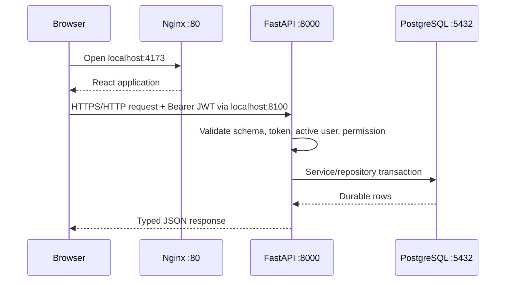

FastAPI creates a synchronous SQLAlchemy session per request. Services apply business rules, commit complete operations, roll back failures, and map expected database conflicts to HTTP 409. The frontend keeps no authoritative ledger cache: after a successful mutation it reloads the relevant server list.

### 4.2 Login and registration

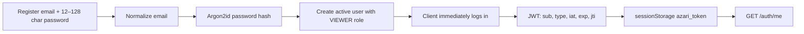

Registration is public and always assigns `VIEWER`; it is not a way to create an accountant. The bootstrap administrator or a future administration workflow must grant a more powerful role directly/externally. The token is an HMAC access token with a configurable 5–1440 minute lifetime (30 minutes by default). There is no refresh token, server-side revocation list, password reset, email verification, MFA, or login rate limiter.

### 4.3 Accounting write

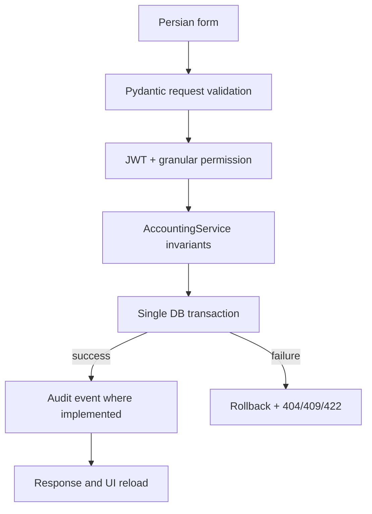

### 4.4 ML prediction

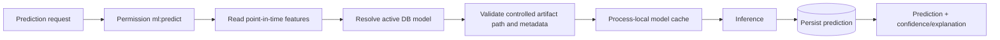

Training never runs in an API request or at application startup. It is an offline command that produces immutable, versioned artifacts; an administrator then registers and activates one.

### 4.5 Concrete action lifecycles

**Create invoice, end to end:** the invoice page first loads customers, products and the current invoice list. The form blocks an empty active-customer set and performs basic required-field checks. On submit, the client sends `POST /invoices` with the Bearer token. FastAPI loads the user and requires `invoices:write`; Pydantic validates field types; `AccountingService` verifies the active customer/product and dates, calculates every line/subtotal/tax/total, and commits the invoice/items. The API returns the persisted invoice, the modal closes, and the list reloads. The common UI currently shows errors but does not provide a universal success-toast guarantee.

The other important actions use the same boundary pattern:

| Action | Frontend → API | Authoritative service/transaction result |
|---|---|---|
| Login | Email/password → `POST /auth/login`; then `/auth/me` | Normalize/verify Argon2id, update last login, audit, issue JWT; client stores token |
| Register | Identity/password → `POST /auth/register`; then login | Normalize, reject duplicate, hash, create active VIEWER and audit |
| Issue invoice | User chooses receivable/revenue accounts → `POST /invoices/{id}/issue` | Re-read DRAFT, find period, create balanced journal, post it and mark/link ISSUED atomically |
| Create payment | Load active customers and their issued/partial invoices → `POST /payments` | Validate exact allocation sum/customer/balances and store DRAFT payment/allocations |
| Post payment | Choose cash/receivable accounts → `POST /payments/{id}/post` | Recheck balance, post journal, update all invoice balances/statuses and payment in one commit |
| Create manual journal | Load accounts/periods; submit header and lines → `POST /journals` | Validate line shape, references and date-in-period; save DRAFT |
| Post manual journal | Confirmation → `POST /journals/{id}/post` | Require DRAFT/open period/active accounts/2+ balanced lines; change to POSTED |
| Reverse journal | Confirmation → `POST /journals/{id}/reverse` | Require eligible POSTED source; create one new swapped, balanced POSTED journal |
| Generate report | Dates/filter → relevant `GET /reports/...` or `/dashboard` | Read-only query over persisted rows; no commit and no accounting mutation |
| Run AI prediction | Typed input/as-of → one `/ml/.../predict` route | Read historical features, load active artifact, infer, persist `ml_predictions`; never post accounting |

Failures before commit leave no partial aggregate. Failures after a service has begun a transaction are rolled back before the error response. Retrying an already completed issue/post is rejected by status and uniqueness rather than producing a second journal.

## 5. Authentication, authorization, and audit

### 5.1 Authentication rules

- Emails are trimmed and case-folded before lookup. Duplicate registration returns a conflict.
- Passwords are stored only as Argon2id hashes. A nonexistent login still performs a dummy hash verification to reduce account-enumeration timing differences.
- JWT decoding requires `sub`, `type`, `iat`, `exp`, and `jti`; `type` must be `access`, and the configured algorithm must be HS256, HS384, or HS512.
- Every protected request reloads the user; missing or inactive users receive 401. A valid user missing a permission receives 403.
- The frontend stores the token in `sessionStorage`, not a cookie, and clears it on logout or 401. Consequently, XSS protection is important and a browser session ends when its tab session is discarded.
- Registration/login successes and failures are audited. Audit metadata is recursively checked to reject sensitive key names such as passwords or tokens.

### 5.2 Current role matrix

`R` means read; `W` means create/update; `P` means post/issue/close; `Predict` permits inference but not model administration.

| Capability | ADMIN | ACCOUNTANT | MANAGER | VIEWER |
|---|---:|---:|---:|---:|
| Users: read | ✓ | — | ✓ | — |
| Parties/products/accounts | R/W | R/W | R | R |
| Journals | R/W/P | R/W/P | R | R |
| Invoices | R/W/Issue | R/W/Issue | R | R |
| Payments | R/W/Post | R/W/Post | R | R |
| Periods | R/W/Close | R/W/Close | R | R |
| Reports/dashboard | ✓ | ✓ | ✓ | ✓ |
| ML read | ✓ | ✓ | ✓ | ✓ |
| ML predict/feedback | ✓ | ✓ | ✓ | — |
| ML register/activate | ✓ | — | — | — |

`ADMIN` receives every seeded permission. The seed also defines `users:create/update/delete`, generic `accounting:read/write`, and `ml:train`, but there are currently no HTTP routes that consume the user-mutation or model-training permissions. Backend dependencies are the security boundary; hidden buttons and pages are only a usability layer.

The exact seeded vocabulary is:

```text
users:read, users:create, users:update, users:delete
accounting:read, accounting:write, reports:read
parties:read, parties:write, products:read, products:write
accounts:read, accounts:write, journals:read, journals:write, journals:post
invoices:read, invoices:write, invoices:issue
payments:read, payments:write, payments:post
periods:read, periods:manage
ml:read, ml:train, ml:predict, ml:manage, ml:feedback
```

ACCOUNTANT receives both generic accounting permissions, reports, ML read/predict/feedback, and every specialized accounting read/write/post/issue/manage permission. MANAGER receives users read, generic accounting read, reports, ML read/predict/feedback, and specialized accounting reads. VIEWER receives generic accounting read, reports, ML read, and specialized accounting reads. There is no `periods:write`; both create and close use `periods:manage`.

**Practical consequence:** a newly registered user is a `VIEWER`. That user can see invoices if permitted by the seeded role but cannot create or issue one. The missing “new invoice” action is therefore current RBAC behavior, not a failed submit.

## 6. Database model and migrations

All business entities use UUID primary keys. Most aggregate/master tables have timezone-aware `created_at` and `updated_at`; line/link/prediction tables instead carry only their relevant event timestamps. Foreign-key delete behavior is deliberate: dependent lines cascade, referenced accounting records are usually restricted, and deleted actors are set to null so history remains.

### 6.1 Every application table

| Table | Purpose and important fields | Constraints and relationships |
|---|---|---|
| `users` | Email, password hash, name, active flag, last login | Unique normalized email; many-to-many roles |
| `roles` | Canonical ADMIN/ACCOUNTANT/MANAGER/VIEWER identities | Unique name; many-to-many permissions/users |
| `permissions` | Granular capability strings | Unique name |
| `user_roles` | User-to-role link | Composite primary key; cascades with either parent |
| `role_permissions` | Role-to-permission link | Composite primary key; cascades with either parent |
| `audit_events` | Actor, action, resource, success, JSON details, occurrence time | Actor becomes null if removed; append-oriented; indexed by actor/action/time |
| `parties` | Customer/supplier identity and contact information | Must be customer, supplier, or both; active flag |
| `products` | SKU, name, unit, price, active flag | Unique SKU; nonnegative price |
| `account_categories` | Category name and account type | Type is ASSET, LIABILITY, EQUITY, REVENUE, or EXPENSE |
| `accounts` | Code/name, category, optional parent, active flag | Unique code; cannot directly parent itself; service prevents deeper cycles |
| `financial_periods` | Name, start/end, OPEN/CLOSED | Valid date interval, unique name; service prevents overlaps |
| `journal_entries` | Number/date/description/period/status/creator/reversal link | Unique number; DRAFT/POSTED/CANCELLED; at most one reversal target |
| `journal_lines` | Account, description, debit, credit | Exactly one side is positive; neither side negative; cascades with journal |
| `invoices` | Number, customer, dates, status, totals, amount paid, issued journal | DRAFT/ISSUED/PARTIALLY_PAID/PAID/CANCELLED; nonnegative totals; due ≥ issue |
| `invoice_items` | Product optional, description, quantity, price, tax, line totals | Positive quantity; nonnegative monetary fields; cascades with invoice |
| `payments` | Reference, customer, date, amount, method, status, posted journal | Positive amount; DRAFT/POSTED/CANCELLED; unique reference/journal |
| `payment_allocations` | Amount of a receipt assigned to an invoice | Positive; one allocation per payment/invoice pair |
| `ml_model_versions` | Pipeline/version, controlled artifact ID, schema/fingerprint/config/metrics/dependencies, activation | Unique pipeline+version; PostgreSQL partial unique index permits one active version per pipeline |
| `ml_predictions` | Model, pipeline, source, JSON output, confidence, review flag, explanation, requester/time | Confidence null or 0–1; indexed for history/source lookup |
| `ml_prediction_feedback` | Actual result, feedback type/comment, submitter/time | VERIFIED/CORRECTION/COMMENT; append-oriented |
| `alembic_version` | Alembic's current revision marker | Framework bookkeeping, not a domain table |

Every application-table primary key is UUID; `user_roles` and `role_permissions` are the two composite-key exceptions. Foreign keys follow the relationships shown below. Operational lookup columns are indexed where queries need them: identity email/role/permission names; audit actor/action/time; SKU/account/journal/invoice/payment identifiers; accounting/report dates and statuses; and ML pipeline/time/model/source. PostgreSQL additionally supplies JSONB for ML structures and a partial unique index for one active model per pipeline.

Mutation/lifetime rules are as important as shape:

- Users, role assignments, master data and DRAFT aggregates are conceptually updateable, but current HTTP mutation coverage is narrower: users/roles are read-only, categories have no update route, and journal/invoice/payment drafts have no edit route.
- Posted journal lines and the financial consequences linked from issued invoices/posted payments must not be edited in place. Corrections use a permitted reversal/new transaction; invoice/payment-generated journals are deliberately protected from the generic reversal endpoint.
- Audit events, predictions and prediction feedback are historical records. No update/delete API exists; actor/requester foreign keys use `SET NULL` so the event can outlive the user.
- Child invoice items, journal lines and allocations cascade only when their aggregate is deleted at the database level. The public API does not expose aggregate deletion.
- Restrictive foreign keys prevent silently deleting accounts, products, customers or invoices still referenced by financial data.
- `alembic_version` is controlled only by Alembic. Manual edits would make migration state untrustworthy.

### 6.2 Entity relationship overview

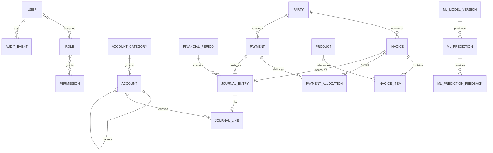

Migration order is identity (`20260817_0001`), core accounting (`cd6670d77e70`), accounting/report indexes (`20260818_0002`), ML integration (`20260825_0003`), then Stage 9 Phase B hardening (`20260827_0004`, current head). Startup runs `alembic upgrade head` before role/bootstrap initialization and Uvicorn.

## 7. Accounting behavior and invariants

All authoritative monetary calculations use `Decimal` and round half-up to two currency decimals. Quantities retain four decimals. The API does not trust invoice totals supplied by a browser.

### 7.1 Numeric example mapped to storage

Suppose invoice `INV-100` has a 1,000 subtotal and 100 tax, for a 1,100 total. Issuing creates one `journal_entries` row and three `journal_lines` rows:

```text
Debit   Accounts Receivable   1,100   -> journal_lines.account_id = selected receivable
Credit  Revenue               1,000   -> journal_lines.account_id = selected revenue
Credit  Tax Liability           100   -> journal_lines.account_id = selected tax liability
```

The `invoices.journal_entry_id` points to that posted entry, `invoices.total=1100`, and status becomes `ISSUED`. A later customer receipt of 500 creates a `payments` row, a `payment_allocations` row for 500, and another posted entry:

```text
Debit   Cash                    500   -> selected cash account
Credit  Accounts Receivable     500   -> selected receivable account
```

The payment links to its journal, the allocation links payment and invoice, `invoices.amount_paid` becomes 500, status becomes `PARTIALLY_PAID`, and outstanding is 600. A further posted allocation of 600 makes it `PAID`. The ML prediction tables are not involved in any of these entries.

### 7.2 Rules the system must NEVER violate

| Rule | Enforced in | Why / failure if removed |
|---|---|---|
| Debit total equals credit total | Journal post service; reporting tests | Otherwise the ledger and balance sheet cannot reconcile |
| Each line has exactly one positive side | Pydantic/service and DB checks | A line could double-count, be meaningless, or hide imbalance |
| Posted journals are not edited/deleted through APIs | Missing mutation routes, status transitions, reversal design | In-place edits destroy auditability and historical reports |
| Posting uses an OPEN period | Journal post service | Closed-period statements could change after sign-off |
| Posted lines reference active accounts | Journal post service | New activity could enter retired accounts |
| A posted journal has at least two lines | Journal post service | A nominally balanced accounting event needs opposing sides |
| Invoice totals are server-calculated | Invoice service with `Decimal` rounding | A manipulated/stale browser could overstate or understate receivables/revenue |
| Issue happens only once from DRAFT | Invoice status check plus unique journal link | Retries could duplicate revenue and receivables |
| Draft invoices have no financial effect | Posted-status report filters and invoice service tests | Operational drafts could inflate receivables, revenue, cash flow, or dashboard totals |
| Zero-total invoices are rejected | Invoice creation service | A non-economic document could enter the posting workflow |
| Source posting accounts have explicit roles | Account role schema/service and filtered UI | Any asset or revenue-category account could be misused as a control account |
| Tax is credited to liability, not revenue | Invoice issue service and tax regression | Revenue would be overstated and tax obligations hidden |
| Payment allocations exactly equal payment | Payment create service | Cash and settled invoice balances would disagree |
| Allocation matches the customer and eligible invoice | Payment service | One customer's money could settle another customer's or invalid document |
| Allocation never exceeds current balance | Create and post recheck | An invoice could have negative outstanding or concurrency could overpay it |
| Payment posts only once | Status, unique reference/journal, transaction | Cash and receivable postings could be duplicated |
| Periods do not overlap | Financial-period service | A transaction date could belong to ambiguous reporting periods |
| Account hierarchy is acyclic | Account update service and self-parent DB check | Recursive navigation/reporting could loop indefinitely |
| Posted account category/role is immutable | Account update service | Historical reports or control-account meaning could be rewritten |
| A party is customer and/or supplier | Schema/service and DB check | A master record would have no supported accounting role |
| Issue/payment multi-row writes are atomic | SQLAlchemy transaction and rollback tests | Half a journal, stale status, or unmatched allocation could remain |
| One reversal per eligible journal | Reversal status/source/unique link checks | Repeated reversals would alternately duplicate financial effects |
| Exactly one active model per pipeline | Activation transaction and PostgreSQL partial unique index | Requests could resolve nondeterministically to different artifacts |
| Prediction time boundaries exclude future history | Feature builders/repository cutoffs and ML tests | Evaluation/inference would leak knowledge unavailable at decision time |

Some invariants are enforced redundantly in schema, service and database because each layer catches a different failure source. Removing a database constraint merely because the service validates would weaken protection against concurrency or non-API writes.

### 7.3 Master data

- A party must remain a customer, a supplier, or both. Invoice/payment operations additionally require an active customer.
- Products and accounts can be deactivated. An invoice product must be active at invoice creation; every account must be active when a journal is posted.
- Account parent changes are rejected if they create self-reference or a deeper hierarchy cycle.
- Accounts have one posting role: `GENERAL`, `CASH`, `RECEIVABLE`, `REVENUE`, or
  `TAX_LIABILITY`. Role/category compatibility is checked, and category or role
  cannot change after the account appears in a posted journal.
- Financial periods may not overlap. Closing changes the period to `CLOSED`; posted financial writes require an `OPEN` period.

### 7.4 Journal lifecycle

```mermaid
stateDiagram-v2
    [*] --> DRAFT: create
    DRAFT --> POSTED: validate period, accounts, 2+ lines, balance
    POSTED --> POSTED_REVERSAL: reverse by swapped debit/credit
    DRAFT --> CANCELLED: model supports status; no current API transition
```

A draft line must put a positive amount on exactly one of debit or credit. Draft creation permits a single line and does not require an open period or active account; posting is the authoritative checkpoint and requires at least two lines, an open period, active accounts, and equal debit/credit totals after cent rounding. A reversal is a new posted journal with swapped sides and an `REV-` number. It uses the original period in the current API and is rejected atomically when that period is closed; the original posted journal remains unchanged. Only one reversal is allowed, and invoice/payment-generated entries cannot be reversed through the generic endpoint. There are no journal edit or delete routes.

### 7.5 Invoice lifecycle

```mermaid
stateDiagram-v2
    [*] --> DRAFT: create + calculate totals
    DRAFT --> ISSUED: post AR debit / revenue credit
    ISSUED --> PARTIALLY_PAID: posted receipt allocation
    ISSUED --> PAID: full posted allocation
    PARTIALLY_PAID --> PAID: remaining posted allocation
    DRAFT --> CANCELLED: status exists; no current API transition
```

Invoice creation requires an active customer, at least one item, and a positive authoritative total. A product item defaults to its catalog price when no price is supplied; a free-form item requires a price. The backend calculates subtotal, tax, total, and each line total. A draft has no ledger, receivable, revenue, cash-flow, report, or dashboard financial effect. Issuing finds the period containing the issue date, requires active accounts with the exact semantic posting roles, creates and posts `INV-{invoice_number}`, debits receivables for the total, credits revenue for the subtotal, and credits a tax-liability account for nonzero tax. It links the journal and marks the invoice issued in one transaction.

**Current accounting limitations:** this is a posting split, not a jurisdiction-specific tax engine; tax rates, filing, settlement, recoverability, and tax returns remain outside scope. There is no invoice edit, cancel, credit-note, or delete endpoint.

### 7.6 Payment lifecycle

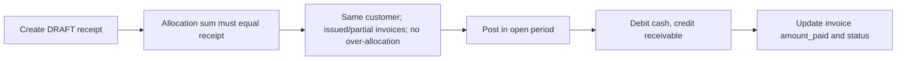

A payment is currently a customer receipt, despite the generic name. Its allocations must sum exactly to its positive amount, cannot duplicate an invoice, cannot cross customers, and cannot exceed each current invoice balance. Posting locks the payment and all allocated invoice rows in deterministic order, rechecks status and balances, requires distinct active ASSET cash/receivable accounts, and requires the receivable account to match each source invoice. It then posts `PAY-{reference}`, updates invoice paid amounts/statuses, and links the journal atomically. Concurrent or repeated posting is protected by those row locks, state checks, unique references/links, database constraints, and rollback. There are no outgoing supplier payments, unallocated receipts, or payment cancellation.

## 8. Reports and dashboard

All ledger-based statements read only `POSTED` journal entries. Date ranges are inclusive.

| Output | Current source/calculation |
|---|---|
| Trial balance | Posted lines by account; debit and credit totals plus balanced flag |
| Income statement | REVENUE and EXPENSE account activity; revenue − expense |
| Revenue / expenses | Type-filtered account summaries |
| Balance sheet | ASSET, LIABILITY, EQUITY through as-of; current earnings from revenue − expense |
| Receivables | Invoice total minus posted allocations through as-of |
| Payables | Liability-account ledger exposure; not supplier-bill detail |
| Cash flow | Posted customer payments as inflows; outflows currently zero |
| Party history | That party's invoices and payments in the requested dates |
| Dashboard | Income, cash, and receivable aggregates for one query window |

Normal balance presentation is debit for assets/expenses and credit for liabilities/equity/revenue. The balance sheet includes calculated current earnings so the equation can be evaluated without closing revenue/expense accounts.

Receivables include only `ISSUED`, `PARTIALLY_PAID`, and still-outstanding `PAID` history. `DRAFT` and `CANCELLED` invoices are excluded, and dashboard outstanding/overdue values reuse the same rule. Creating or viewing a draft and refreshing the dashboard are therefore read-only with respect to posted financial values.

Reports return complete result sets without pagination. “Payables” and “cash flow” should be interpreted narrowly as described above.

## 9. Machine-learning subsystem

### 9.1 Shared offline contract

Each pipeline trains from deterministic synthetic data using a configured seed. The default artifact location is `ml/models/<pipeline>/<version>/`, containing `model.joblib` and `metadata.json`. Metadata schema v1 records pipeline, version, training time, SHA-256 dataset fingerprint, exact feature schema, seed/config, metrics, library versions, and `synthetic=true`. Generated models/data are ignored by Git except directory placeholders.

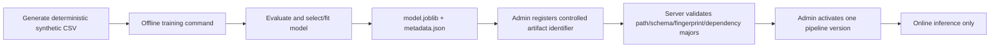

### 9.2 Transaction classification

- **Goal:** map a Persian transaction description to an accounting category.
- **Training data/features:** 900 synthetic labeled descriptions; word TF-IDF with unigram/bigram features and `min_df=2`.
- **Selection:** seeded stratified 75/25 split; compare Multinomial Naive Bayes with calibrated Linear SVC; select by macro F1 then accuracy.
- **Online behavior:** return predicted category and `predict_proba` confidence. The application-level `ML_CONFIDENCE_THRESHOLD` determines manual review.
- **Persistence/privacy:** the raw description is not stored in prediction JSON; an optional caller reference may identify the source.
- **Limits:** synthetic vocabulary and confidence calibration do not establish production accuracy.

TF-IDF converts variable-length text into a sparse numeric vector that emphasizes terms distinctive to a description/category; that matches the linear/sparse classifiers actually serialized. MultinomialNB estimates category likelihood from weighted term evidence with a conditional-independence assumption. Linear SVC learns separating margins but has no native probability, so calibration supplies `predict_proba` for the common confidence contract. The repository chooses between them by held-out metrics rather than a hard-coded preference.

### 9.3 Payment-delay risk

- **Goal:** estimate whether an invoice will be paid more than the configured delay (default seven days) after due date.
- **Features:** amount, prior invoice count/average amount/average delay/late rate/paid rate, invoice/payment frequency, outstanding balance, and customer tenure.
- **Leakage control:** each training row uses only history completed before that invoice; data is chronologically split 70/15/15.
- **Model:** class-balanced random forest (`180` trees, depth `8`, minimum leaf `3`, deterministic single-job fitting). Metrics include accuracy, F1, ROC AUC, and validation AUC.
- **Online explanation:** ranks `(value − training baseline) × global impurity importance`. This is a deterministic heuristic, not SHAP and not a causal explanation.
- **Limits:** the UI offers issued/partially paid invoices, but the backend prediction method only checks that the selected invoice date is not in the future; direct API callers can currently request a draft invoice.

### 9.4 Cash-flow forecasting

- **Goal:** forecast future daily customer-receipt inflows.
- **Model:** linear regression over trend plus weekly, monthly, and annual sine/cosine harmonics. It is not Prophet.
- **Evaluation:** chronological final-horizon backtest, MAE/RMSE; final fit uses all training rows. A residual standard deviation supplies a fixed approximate 95% interval.
- **Online behavior:** reads posted payments only, applies a recent 90-day mean level adjustment to the offline baseline, and forecasts 1–365 future days.
- **Limits:** there is no online retraining, expense/outflow series, exogenous seasonality, bank balance, or probabilistic interval calibration.

The repository does not record a product decision memo for choosing harmonic regression. Its implemented properties are lightweight, deterministic fitting and explicit repeating-calendar terms; those properties explain how it behaves, but should not be overstated as proof it is the best forecasting algorithm.

### 9.5 Customer segmentation

- **Goal:** assign customers to behavior/value clusters.
- **Features:** invoice count, total and average invoicing, total payments, average delay, outstanding balance, and payment frequency.
- **Training:** seeded 80/20 split, scaler fit on training data, K-means for `k=2..6` with 20 initializations; maximum silhouette wins, ties prefer smaller `k`.
- **Online behavior:** constructs one customer's point-in-time feature vector, scales it, predicts a cluster, and returns a rule-generated description based on learned centroids.
- **Limits:** customers without usable invoice/payment history receive 422. Labels such as high-value or slow-paying are relative descriptions, not policy decisions.

The silhouette score compares how close a sample is to its own cluster versus other clusters; larger is better separated under this geometry. It selects `k`, while the raw integer cluster ID remains arbitrary. Business text is therefore derived from centroid behavior and must not attach permanent meaning to “cluster 0.”

### 9.6 Registry, activation, cache, feedback, and security

Artifact identifiers must match a restricted `pipeline/version` form and resolve below `ML_MODEL_DIR`; traversal is rejected. Registration validates the pipeline, directory, loader/schema, metadata version, feature names, and dependency major versions. The database prevents duplicate versions and, on PostgreSQL, more than one active model per pipeline. Activation deactivates the former version and activates the requested version transactionally.

Loaded models live in an in-process cache keyed by model UUID; activating a model invalidates that pipeline's cached entries. Separate Uvicorn workers do not share this memory cache. Predictions record structured output, confidence, review decision, explanation, model and requester. Feedback is append-only and does not automatically retrain a model. Registration, activation, and feedback are audited; the prediction row itself is the durable inference history rather than a duplicate audit event. Missing models return 404, incompatible artifacts 422, and execution failures 503.

### 9.7 Exact ML/accounting write boundary

Payment risk and segmentation read invoice/customer/payment history at an explicit `as_of`; cash forecasting reads posted receipts through that boundary. Point-in-time feature queries exclude later accounting facts, and training constructs each historical example from facts available before that example. Classification reads only its request text. These protections prevent future leakage, but do not turn a prediction into accounting.

An inference request is allowed to insert an `ml_predictions` row. A feedback request may insert `ml_prediction_feedback` and its audit event. Model register/activate may change `ml_model_versions` and audit history. None of these paths calls invoice issue, payment post, journal post, or report mutation code. It cannot change invoices, allocations, journals, balances, revenue or dashboard totals. Conversely, accounting writes do not automatically invoke ML.

ML access is separated into `ml:read`, `ml:predict`, `ml:feedback`, and `ml:manage`; `ml:train` remains seeded without an API route. Artifact identifiers are allow-listed in shape and contained below a configured root. API errors describe unavailability/incompatibility without returning the resolved server filesystem path, artifacts do not contain application secrets, and transaction classification deliberately omits raw request text from persistence. Other structured prediction inputs/outputs may still contain business identifiers or aggregates and must be protected as application data.

## 10. API surface

All paths below are under `/api/v1`. A public route is explicitly identified; every other route requires a valid active user and its route dependency.

| Area | Method and path | Permission / purpose |
|---|---|---|
| Health | `GET /health`, `GET /ready` | Public process liveness and PostgreSQL-backed readiness |
| Auth | `POST /auth/register`, `POST /auth/login` | Public registration/login |
| Auth | `GET /auth/me` | Any authenticated user |
| Users | `GET /users` | `users:read` |
| Parties | `POST/GET /parties`, `GET/PATCH /parties/{id}` | `parties:write/read` |
| Products | `POST/GET /products`, `GET/PATCH /products/{id}` | `products:write/read` |
| Categories | `POST/GET /account-categories` | `accounts:write/read` |
| Accounts | `POST/GET /accounts`, `GET/PATCH /accounts/{id}` | `accounts:write/read` |
| Periods | `POST/GET /periods`, `POST /periods/{id}/close` | POST/close: `periods:manage`; GET: `periods:read` |
| Journals | `POST/GET /journals`, `GET /journals/{id}`, `POST .../post`, `POST .../reverse` | `journals:write/read/post` |
| Invoices | `POST/GET /invoices`, `GET /invoices/{id}`, `POST .../issue` | `invoices:write/read/issue` |
| Payments | `POST/GET /payments`, `GET /payments/{id}`, `POST .../post` | `payments:write/read/post` |
| Reports | `GET /reports/trial-balance`, `/income-statement`, `/revenue`, `/expenses` | `reports:read`; start/end dates |
| Reports | `GET /reports/balance-sheet`, `/receivables`, `/payables` | `reports:read`; as-of (receivables can filter customer) |
| Reports | `GET /reports/cash-flow`, `/parties/{id}/history` | `reports:read`; date range |
| Dashboard | `GET /dashboard` | `reports:read` |
| ML models | `GET /ml/models`, `GET /ml/models/{pipeline}/active` | `ml:read` |
| ML models | `POST /ml/models/register`, `POST /ml/models/{id}/activate` | `ml:manage` |
| ML inference | `POST /ml/transactions/classify`, `/payment-risk/predict`, `/cash-flow/forecast`, `/segmentation/predict` | `ml:predict` |
| ML history | `GET /ml/predictions`, `GET /ml/predictions/{id}` | `ml:read` |
| ML feedback | `POST /ml/predictions/{id}/feedback` | `ml:feedback` |

Pydantic structural/field errors normally return 422. Domain missing records return 404, conflicting state/uniqueness returns 409, unauthenticated/invalid/inactive identity returns 401, and missing permission returns 403.

### 10.1 Exact route inventory (57 operations)

```text
PUBLIC/AUTH  GET /health; GET /ready; POST /auth/register; POST /auth/login; GET /auth/me
USERS        GET /users [users:read]

PARTIES      POST /parties [write]; GET /parties [read]
             GET /parties/{item_id} [read]; PATCH /parties/{item_id} [write]
PRODUCTS     POST /products [write]; GET /products [read]
             GET /products/{item_id} [read]; PATCH /products/{item_id} [write]
CATEGORIES   POST /account-categories [accounts:write]
             GET /account-categories [accounts:read]
ACCOUNTS     POST /accounts [write]; GET /accounts [read]
             GET /accounts/{item_id} [read]; PATCH /accounts/{item_id} [write]
PERIODS      POST /periods [manage]; GET /periods [read]
             POST /periods/{item_id}/close [manage]
JOURNALS     POST /journals [write]; GET /journals [read]
             GET /journals/{item_id} [read]; POST /journals/{item_id}/post [post]
             POST /journals/{item_id}/reverse [post]
INVOICES     POST /invoices [write]; GET /invoices [read]
             GET /invoices/{item_id} [read]; POST /invoices/{item_id}/issue [issue]
PAYMENTS     POST /payments [write]; GET /payments [read]
             GET /payments/{item_id} [read]; POST /payments/{item_id}/post [post]

REPORTS      GET /reports/trial-balance; GET /reports/income-statement
             GET /reports/revenue; GET /reports/expenses; GET /reports/balance-sheet
             GET /reports/receivables; GET /reports/payables; GET /reports/cash-flow
             GET /reports/parties/{party_id}/history; GET /dashboard [all reports:read]

ML MODELS    GET /ml/models; GET /ml/models/{pipeline}/active [ml:read]
             POST /ml/models/register; POST /ml/models/{model_id}/activate [ml:manage]
ML PREDICT   POST /ml/transactions/classify; POST /ml/payment-risk/predict
             POST /ml/cash-flow/forecast; POST /ml/segmentation/predict [ml:predict]
ML HISTORY   GET /ml/predictions; GET /ml/predictions/{prediction_id} [ml:read]
ML FEEDBACK  POST /ml/predictions/{prediction_id}/feedback [ml:feedback]
```

In the accounting groups, bracketed `read`, `write`, `post`, `issue`, and `manage` inherit the group prefix (for example, invoice `[write]` means `invoices:write`). `/auth/me` requires authentication but no named business permission.

## 11. Frontend behavior

The document root is Persian (`lang=fa`) and RTL. The application has grouped top navigation on desktop and a right-side drawer on mobile, mobile card layouts, modal/bottom-sheet forms, reusable loading/empty/error states, a light/dark theme stored in `localStorage`, and a Jalali/Gregorian display preference (Jalali by default). Dates are still transported to the API as ISO Gregorian values. Charts are small native CSS/SVG components, not a charting library.

UI language/direction is not a database encoding or API format: labels are Persian and layout is RTL, financial digits deliberately render as English/Latin digits, the selected calendar controls display/input conversion, API dates remain ISO Gregorian, JSON field/enum names remain the English contracts, and PostgreSQL stores Unicode text without translating it.

The client uses a compact History API router rather than React Router. Authenticated routes include dashboard, parties, products, accounts, periods, journals, invoices, payments, nine report pages, AI dashboard/classification/risk/forecast/segments/models, users, and display settings. `/login` and `/register` are public UI routes. Nginx's SPA fallback makes direct navigation work in production.

Pages and action buttons are filtered by permissions. Forms that require prerequisite data (for example, an active customer for an invoice or account lines for a journal) display Persian guidance and disable impossible submission. Server data is loaded on mount and explicitly reloaded after writes; there is no Redux store or query-cache framework. The common API client sends JSON/Bearer headers and converts HTTP status classes into Persian messages, although this means detailed backend validation text is not always shown.

| Frontend route(s) | Page / gate |
|---|---|
| `/login`, `/register` | Public authentication pages |
| `/dashboard` | Dashboard; `reports:read` |
| `/parties`, `/products`, `/accounts`, `/periods` | Master-data pages; corresponding `*:read` |
| `/journals`, `/invoices`, `/payments` | Transaction pages; corresponding `*:read`; actions use write/post/issue permissions |
| `/reports/trial-balance`, `/reports/income-statement`, `/reports/balance-sheet` | Main statements; `reports:read` |
| `/reports/revenue`, `/reports/expenses`, `/reports/receivables`, `/reports/payables`, `/reports/cash-flow`, `/reports/party-history` | Detailed reports; `reports:read` |
| `/ai` | AI dashboard; `ml:read` |
| `/ai/classification`, `/ai/risk`, `/ai/forecast`, `/ai/segments` | Four inference pages; `ml:predict` |
| `/ai/models` | Model registry/activation; `ml:manage` |
| `/users` | Read-only user page; `users:read` |
| `/settings` | Authenticated display settings; no extra route permission |

**Font reality:** CSS requests `IRANSans`, then `IRANSansX`, `Vazirmatn`, `Tahoma`, and sans-serif. The repository contains no licensed IRANSans font file and no `@font-face` declaration. Unless the host already has that font installed, the browser falls back. Therefore “IRANSans is bundled and guaranteed” would be false.

**Current UI limitations:** user management is read-only; settings affect display only; there is no comprehensive toast/notification system; some transaction buttons do not expose a busy state; and the test suite is component/SSR-oriented rather than full browser automation.

## 12. Docker, ports, startup, and configuration

### 12.1 Current port map

| Service | Host | Container/internal | Notes |
|---|---:|---:|---|
| Frontend | `4173` | `80` | `http://localhost:4173` |
| Backend | `8100` | `8000` | API base `http://localhost:8100/api/v1` |
| PostgreSQL | none | `5432` | Reachable only as service `db` inside Compose |

Host ports changed because Windows reserved the original frontend range around 5173/5174 and the range 7927–8026 containing backend port 8000. Container ports and service-to-service addresses did not change. The frontend browser URL uses host `localhost:8100`; the backend uses `db:5432`, never localhost, for PostgreSQL.

### 12.2 Startup sequence

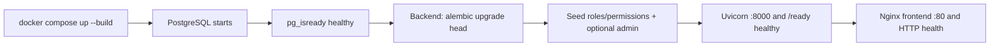

The backend image installs the project including ML dependencies, copies the controlled model tree, and runs as a non-root system user. The frontend is built in Node 22 Alpine and served by Nginx. Ignore files exclude Python caches, virtual environments, secrets, Node modules/builds, Git data, and generated model payloads without excluding required source or lock files.

An **image** is the immutable built template; a **container** is one running instance. Compose builds/starts the instances on one private **network**, where service DNS names such as `db` work. The named `postgres_data` **volume** outlives a recreated database container, while the ML model bind mount exposes the controlled host artifact directory read-only at `/app/ml/models`. Healthchecks do more than show status: `depends_on` delays backend until PostgreSQL is healthy and frontend until database-backed backend readiness succeeds; nginx also has its own HTTP healthcheck.

### 12.3 Environment variables

| Variable | Example shape / default | Secret? | Consumer and purpose |
|---|---|---:|---|
| `DATABASE_URL` | `postgresql+psycopg://user:<password>@db:5432/name`; required | Yes | Backend engine and Alembic; Compose networking must use `db` |
| `JWT_SECRET` | `<32+-character-random-secret>`; required, min 32 | Yes | Backend token HMAC signing/verification |
| `JWT_ALGORITHM` | `HS256`; only HS256/384/512 | No | Backend JWT encoder/decoder |
| `ACCESS_TOKEN_EXPIRE_MINUTES` | `30`; allowed 5–1440 | No | Backend access-token lifetime |
| `APP_ENV` | `development` | No | Backend environment label |
| `APP_NAME` | `Azari Intelligent Accounting` | No | FastAPI/application identity |
| `API_V1_PREFIX` | `/api/v1` | No | Prefix used when mounting the API router |
| `CORS_ORIGINS` | `["http://localhost:4173"]` | No | Backend browser-origin allow-list |
| `ML_MODEL_DIR` | `/app/ml/models` in Compose | Path may be sensitive | Backend controlled artifact root and startup directory |
| `ML_CONFIDENCE_THRESHOLD` | `0.65`, range 0–1 | No | Online classification review and offline configuration |
| `ML_RANDOM_SEED` | `42` | No | Offline synthetic generation/training reproducibility |
| `ML_RISK_DELAY_DAYS` | `7` | No | Offline delayed-payment target definition |
| `ML_FORECAST_HORIZON` | `30` | No | Offline forecast backtest horizon |
| `BOOTSTRAP_ADMIN_EMAIL` | `admin@example.invalid`; optional with password | Personal/config | Bootstrap script's idempotent admin identity |
| `BOOTSTRAP_ADMIN_PASSWORD` | `<strong-unique-password>`; optional, 12–128 | Yes | Bootstrap script; must appear with email |
| `POSTGRES_DB` | `azari` | No | PostgreSQL container database creation/healthcheck |
| `POSTGRES_USER` | `azari` | Usually config | PostgreSQL container user/healthcheck |
| `POSTGRES_PASSWORD` | `<strong-database-password>` | Yes | PostgreSQL initialization and composed connection URL |
| `VITE_API_URL` | `http://localhost:8100/api/v1` | No | Vite build-time browser API base; embedded in frontend assets |

Settings load `.env` and `../.env`, use case-sensitive names, forbid unknown Pydantic settings fields, and validate prefixes/ranges. `.env` is ignored and must never be committed; `.env.example` is the safe template.

## 13. Development and verification

Typical local commands (PowerShell syntax may require the virtual environment's executable path):

```powershell
docker compose config
docker compose up -d --build
docker compose ps
curl http://localhost:8100/api/v1/health
curl http://localhost:8100/api/v1/ready
curl http://localhost:4173

pytest backend/tests --cov=backend.app
ruff check backend scripts ml
mypy backend/app scripts ml

cd frontend
npm ci
.\test.cmd
npm run typecheck
npm run build

cd ../backend
alembic upgrade head
alembic check
```

Backend tests default to an in-memory SQLite database with static pooling, create/drop metadata around tests, and seed RBAC. Separate scripts cover PostgreSQL-specific migration/database behavior. This split is fast but means SQLite alone cannot prove PostgreSQL partial indexes/JSONB behavior. Ruff enforces `E`, `F`, `I`, `B`, and `UP` with Python 3.12 and a 100-column limit. Mypy is strict with the Pydantic plugin. The frontend test command combines TypeScript checking, Vite server-side module transformation, and Node's test runner; production build is an independent gate.

| Verification layer | What it protects against | Important boundary |
|---|---|---|
| Service/unit tests | Broken calculations, transitions, rollback and invariants | Must assert persisted outcomes, not only response codes |
| API tests | Schema, auth, RBAC, status mapping and response contracts | Uses the real FastAPI dependency stack |
| Database tests | Constraints, relationships, bootstrap and indexes | SQLite tests are fast; PostgreSQL checks cover dialect-specific behavior |
| ML tests | Temporal leakage, deterministic training, selection and artifact round-trip | Metrics on synthetic data test software, not production fitness |
| Frontend tests | RTL metadata, routing/permissions, formatting, auth/API and prerequisite UI regressions | SSR/source tests are not full browser interaction |
| Alembic checks | Upgrade ordering and ORM/schema drift | Run against an isolated PostgreSQL target when proving production behavior |
| Ruff | Syntax/import/common correctness and modernization issues | Not a type or runtime test |
| Strict mypy | Python cross-layer type contract errors | Must use `--config-file backend/pyproject.toml` from repository root |
| TypeScript | Frontend compile-time contracts | Does not validate live backend responses |
| Production build | Vite bundling, imports and deployable assets | Does not prove host networking |
| Compose/HTTP verification | Rendered settings, service health/dependencies and host reachability | Avoid printing resolved secrets from `docker compose config` |

## 14. Delivery history: Stages 1–8

| Stage | Goal and main features | DB/API/architecture change | Recorded verification |
|---|---|---|---|
| 1 | Runnable foundation and health surface | Three containers, network/volume, Dockerfiles, `/health`; Windows-safe 4173/8100 mappings and build ignores | Compose render/build/health and both host URLs |
| 2 | Durable identity and security | Identity/audit migration, SQLAlchemy sessions, JWT/Argon2id, database RBAC, bootstrap; auth/users APIs | Backend tests, migration, Compose persistence/security checks |
| 3 | Accounting vertical slice | Master/transaction tables; protected party/product/account/period/journal/invoice/payment routes and atomic services | Posting/reversal/rollback/constraint tests |
| 4 | Read-only reporting | Reporting repositories/schemas/services; statement, receivable/payable/cash/party/dashboard endpoints and indexes | Report/reconciliation/date-filter tests |
| 5 | Reproducible offline intelligence | No application DB/API wiring yet; four synthetic-data pipelines and artifact/metadata contract | 11 ML tests for leakage, reproducibility and round-trip |
| 6 | Production ML integration | Three ML tables/migration; safe registry/cache, active version, inference/history/feedback APIs and RBAC | API/DB/artifact/security and live controlled-model checks |
| 7 | Persian production client | React/Vite/Nginx SPA, JWT/RBAC contexts, operational/report/AI route families | TypeScript, frontend tests/build and Compose reachability |
| 8 | Production-hardening pass | Responsive/accessibility/error/prerequisite improvements, non-root image and broader regression evidence; no new accounting model | 68 then-current backend/ML tests, 17 then-current frontend tests, lint/type/build/Compose/migration/restart evidence |
| Post-8 | Self-service account creation | Public register page/API integration; no schema change; every new user gets VIEWER | Current frontend registration regression test; current combined suites listed below |

Stage files are historical evidence. Statements such as “the next stage has not started,” old ports, or old test counts were true at their recorded time and are not current configuration. This handbook and live source take precedence for current operation.

## 15. Known limitations and contradictions

| Status | Scope |
|---|---|
| Implemented | Identity/RBAC, accounting master data, double-entry posting, sales receivables/receipts, reports/dashboard, four offline/online ML flows, Persian responsive frontend, three-service runtime |
| Partially implemented | Payables (liability exposure only), cash flow (receipt inflow only), user administration (read-only), display settings, model feedback, invoice/payment/journal lifecycle transitions |
| Deferred but evidenced by gaps | Supplier bills/outgoing payments, role mutation, token refresh/recovery/MFA/rate limiting, pagination, distributed cache invalidation, automated retraining, real-data model validation, browser E2E |
| Future work, not a current promise | Any additional ERP domain such as inventory, payroll, multi-company, tax filing, currencies or bank reconciliation requires explicit design before implementation |

1. Self-registration creates a read-only Viewer, so a new user cannot add an invoice without role assignment.
2. IRANSans is named but not bundled, so typography depends on host fonts/fallbacks.
3. Supplier bills and supplier payments are absent; payables are liability-ledger exposure only.
4. Cash flow is posted customer-receipt inflow only; outflows are always zero.
5. Invoice tax posts separately to a `TAX_LIABILITY` account; jurisdiction-specific tax calculation, filing, and settlement remain unsupported.
6. Account categories enforce ASSET receivable/cash and REVENUE invoice destinations, but there is no finer control-account designation inside ASSET.
7. No invoice/journal/payment editing, deletion, cancellation workflow, or credit notes are exposed.
8. No multi-company/tenant isolation, currencies, exchange rates, warehouses, or inventory movements.
9. No pagination for operational lists, reports, predictions, or users.
10. No refresh tokens, MFA, password reset, email verification, token revocation, or rate limiting.
11. Roles and users cannot be managed through mutation APIs/UI; the users page is read-only.
12. ML is trained on synthetic data and must not be treated as production-validated decision support.
13. Model cache is process-local; workers do not share invalidation state.
14. Feedback does not trigger training and there is no API training endpoint despite a seeded `ml:train` permission.
15. Segmentation cannot score customers without sufficient history.
16. Forecasting has no outgoing cash or exogenous drivers and uses approximate intervals.
19. Frontend API error normalization can hide detailed field/domain messages.
20. Browser-level end-to-end testing is not implemented.

## 16. Debugging guide (22 common problems)

For accounting defects trace `Frontend → API route → service → repository/query → database row → report`. Do not delete rows, edit posted journals, or reset the database to hide a mismatch.

| # / symptom | Possible cause and where to look | Useful command / normal result / what not to do |
|---|---|---|
| 1. Frontend cannot connect to backend | Wrong build-time URL, backend unhealthy, CORS; `frontend/src/services/api.ts`, `.env`, Compose logs | `curl http://localhost:8100/api/v1/health`; expect 200. Rebuild after Vite env changes; do not replace Docker service DB addresses with localhost. |
| 2. Backend cannot connect to PostgreSQL | Bad URL/credential, DB not healthy, migration issue; `compose.yaml`, backend logs | `docker compose ps` and `docker compose logs db backend`; expect healthy DB and migration completion. Do not expose credentials in tickets. |
| 3. Docker container does not start | Build failure, required env missing, failed health dependency; Dockerfile/Compose logs | `docker compose config --quiet`, then `docker compose up --build`; fix first failing service. Do not bypass health ordering blindly. |
| 4. Port binding failure | Windows excluded range or occupied port; rendered `ports` | `docker compose config --format json`, `netsh interface ipv4 show excludedportrange protocol=tcp`; normal hosts are 4173/8100. Do not alter Windows reservations for this app. |
| 5. Login fails | Wrong credentials, normalized duplicate assumption, inactive user; auth service/audit | Inspect sanitized backend log/audit and try `/auth/login`; expect generic invalid-credentials detail. Do not log or manually compare plaintext passwords. |
| 6. 401 | Missing/expired/malformed token, changed JWT secret, inactive/missing user; token dependency | Clear `sessionStorage`, log in, call `/auth/me`; expect current user. Do not weaken signature/expiration checks. |
| 7. 403 | Valid user lacks backend permission; bootstrap role matrix and route dependency | Inspect `/auth/me` permissions and `backend/app/db/bootstrap.py`; assign the correct role. Do not only unhide the frontend button. |
| 8. Invoice cannot be created | Viewer role, no active customer, invalid product/date/item; invoice form/schema/service | Check user permission and active `is_customer=true` party; expect 201 DRAFT. Do not invent totals client-side or delete old invoices. |
| 9. Invoice cannot be issued | Not DRAFT, no containing OPEN period, inactive accounts, duplicate issue; issue/post service | Inspect invoice/period/account state and API 409/422; expect one linked POSTED `INV-...` journal. Do not manually set status/journal FK. |
| 10. Payment cannot be posted | Allocation mismatch/overpayment, wrong customer/status, closed period/account; payment service | Compare allocations to amount/balance, inspect transaction response; expect one `PAY-...` journal and atomic invoice update. Do not edit `amount_paid` directly. |
| 11. Dashboard numbers are wrong | Wrong date window, ledger account classification, unposted journal, or receivable defect; reporting service | Reconcile trial balance/income/cash/receivables with posted rows. Do not add compensating fake transactions before finding the source. |
| 12. Dashboard grows unexpectedly | Unexpected issued invoice/payment, date window, or report regression | Inspect `ReportingService.receivables_as_of`; drafts and refreshes should not affect totals. Reconcile source records; do not delete drafts merely to reduce the KPI. |
| 13. Report does not reconcile | Draft vs posted confusion, date/type mapping, rounding or source row issue; reporting repositories/services/tests | Run report tests and query relevant POSTED lines; compare Decimal totals. Do not calculate authoritative replacements in React. |
| 14. AI prediction fails | Missing permission/model/history, invalid input, execution error; ML route/service | Check HTTP status: 403 permission, 404 model, 422 data/artifact, 503 inference. Do not trigger training inside the request. |
| 15. Model artifact cannot load | Unsafe identifier, missing files, metadata/schema/version/dependency mismatch; registry | Inspect artifact directory and sanitized backend error; run ML round-trip tests. Do not relax containment or load arbitrary pickle paths. |
| 16. No active model | Artifact trained but not registered/activated, wrong pipeline | As ADMIN list `/ml/models`, register controlled identifier and activate; expect exactly one active. Do not toggle DB flags manually. |
| 17. Unexpected ML result | Synthetic-domain gap, low confidence, as-of history, relative cluster label; prediction/explanation/metadata | Inspect model version, confidence/review, features and training metrics; submit feedback if appropriate. Do not treat probability/cluster as a posting command. |
| 18. Migration fails | Wrong revision/database URL, partial prior state, schema drift; Alembic/logs | From `backend`, run `alembic current`, `alembic upgrade head`, `alembic check` against an isolated target. Do not edit `alembic_version` or drop production tables. |
| 19. Frontend build fails | Dependency lock mismatch, TypeScript/import/env error; npm/Vite output | `npm ci`, `npm run typecheck`, `npm run build`; expect assets in `dist`. Do not commit `node_modules` or bypass the compiler. |
| 20. TypeScript fails | Contract/nullability/component error; exact compiler location | `npm run typecheck`; fix source/contracts together. Do not use broad `any` merely to silence a real mismatch. |
| 21. Strict mypy fails | Wrong config invocation, annotation/Pydantic/third-party issue | From root: `python -m mypy --config-file backend/pyproject.toml backend ml scripts`; expect 91 files clean. Do not omit strict mode or blindly ignore project modules. |
| 22. Test fails | Regression, environment/fixture issue, PostgreSQL-only assumption, stale artifact; failing test/log | Run the smallest failing test then full backend/ML/frontend suites. The known pytest-cache ACL warning is non-fatal. Do not delete business data or rewrite the test to accept wrong behavior. |

## 17. Ten key data-flow diagrams

The preceding sections contain detailed diagrams; this compact index shows ten distinct flows and where ownership changes:

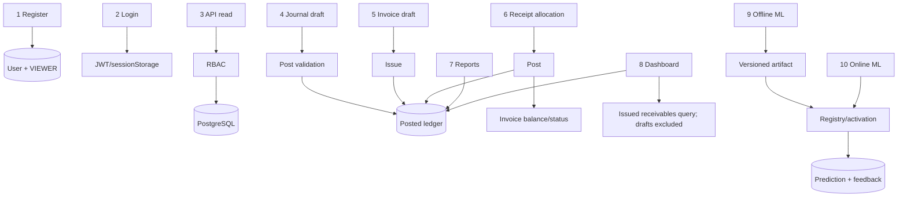

Readable fallbacks and the exact ten requested paths are:

1. **Login:** `Login form → /auth/login → normalize + Argon2 verify → audit/last_login → JWT → sessionStorage → /auth/me`.
2. **Invoice creation:** `Load customers/products → form → /invoices → RBAC/schema → calculate lines/totals → invoice + items DRAFT → reload`.
3. **Invoice issuance:** `DRAFT invoice + accounts → issue service → open period → INV journal → balanced POSTED lines → invoice ISSUED`.
4. **Payment posting:** `DRAFT receipt + allocations → recheck balances → PAY journal → POSTED → invoice amount_paid/status → payment POSTED`.
5. **Manual journal posting:** `DRAFT header/lines → active accounts/open period/2+ lines/balance → POSTED ledger entry`.
6. **Report generation:** `Date/filter → reports:read → reporting query → POSTED ledger/eligible operational rows → Decimal response → Persian table/chart`.
7. **Transaction classification:** `Description → TF-IDF artifact → selected classifier → category/probability → threshold/review → ml_predictions`.
8. **Payment-risk prediction:** `Customer invoice + as_of → prior invoice/payment features → Random Forest probability/signals → ml_predictions`.
9. **Cash forecast:** `Posted receipts through as_of → daily series/recent adjustment → harmonic regression → 1–365 points/intervals → ml_predictions`.
10. **Customer segmentation:** `Customer + as_of → aggregate behavior features → StandardScaler → K-Means → cluster/relative description → ml_predictions`.

In every AI flow the final database write is prediction history, not `journal_entries`, `invoices`, `payments`, or a report value.

## 18. Twenty things every contributor should know

1. Live source and Alembic migrations outrank historical stage prose.
2. The backend, not React, owns accounting totals and status transitions.
3. Posted journals are the ledger source for financial statements.
4. A draft is mutable/preparatory in concept, but edit APIs are not currently implemented.
5. Financial writes must ultimately post in an open period.
6. Debit and credit equality is checked at cent precision.
7. Invoice issue and payment post are atomic multi-entity transactions.
8. Never delete posted/audit/prediction history to “fix” a state.
9. Never commit `.env`, JWT secrets, database passwords, or generated model artifacts.
10. Browser-to-backend uses host 8100; container-to-container backend-to-DB uses `db`.
11. Host 4173/8100 were chosen around real Windows excluded ranges.
12. Registration grants VIEWER only; UI visibility follows permissions.
13. Backend authorization remains mandatory even when a button is hidden.
14. All production IDs are UUIDs and dates/timestamps must preserve their semantic timezone/date meaning.
15. ML training is offline; inference must never silently train.
16. Model artifacts are controlled, versioned, schema-validated inputs—not arbitrary paths.
17. Synthetic ML metrics are engineering checks, not business accuracy claims.
18. Add a migration for schema changes; never rely on `create_all` in production.
19. Run tests, Ruff, strict mypy, frontend typecheck/tests/build, and relevant migration checks before delivery.
20. Preserve documented defects as facts, but do not normalize them into intended behavior.

## 19. Bilingual glossary / واژه‌نامه دوزبانه

| English | فارسی | Meaning here |
|---|---|---|
| Account | حساب / سرفصل | Ledger account receiving debit/credit lines |
| Account category | گروه حساب | ASSET/LIABILITY/EQUITY/REVENUE/EXPENSE classification |
| Accounts receivable | حساب‌های دریافتنی / مطالبات | Amount customers owe |
| Accounts payable | حساب‌های پرداختنی | Implemented only as liability-ledger exposure |
| Allocation | تخصیص پرداخت | Portion of a receipt applied to an invoice |
| Audit event | رویداد ممیزی | Append-oriented security/business action record |
| Balance sheet | ترازنامه | Assets, liabilities, equity and current earnings as of a date |
| Cash flow | جریان نقدی | Currently posted customer-receipt inflows |
| Credit | بستانکار | Right side of a journal line |
| Debit | بدهکار | Left side of a journal line |
| Draft | پیش‌نویس | Created but not posted/issued |
| Financial period | دوره مالی | Date interval controlling posting availability |
| Invoice | فاکتور فروش | Customer receivable document |
| Issue | صدور | Turn a draft invoice into posted AR/revenue activity |
| Journal entry | سند حسابداری | Balanced group of debit/credit lines |
| Ledger | دفتر کل | Posted journal activity |
| Party | طرف حساب | Customer and/or supplier master record |
| Payment | دریافت | In current product, an incoming customer receipt |
| Post | ثبت قطعی | Validate and commit a draft to the ledger |
| Reversal | سند معکوس | New posted entry with debit/credit sides swapped |
| Role | نقش | Named permission collection |
| Permission | مجوز | Granular backend-enforced capability |
| Model registry | مخزن ثبت مدل | Database metadata connecting versions to safe artifacts |
| Prediction | پیش‌بینی | Persisted output from an active ML model |
| Point-in-time feature | ویژگی در لحظه | Feature built only from information available by its as-of time |
| Synthetic data | داده مصنوعی | Generated training data, not real customer records |
| API | رابط برنامه‌نویسی کاربردی | Versioned HTTP contract between frontend and backend |
| JWT | توکن وب JSON | Signed access-token format used for authentication |
| RBAC | کنترل دسترسی مبتنی بر نقش | Users receive permissions through database roles |
| ORM | نگاشت شیء-رابطه‌ای | SQLAlchemy mapping between Python objects and tables |
| Migration | مهاجرت پایگاه داده | Ordered Alembic schema change |
| Repository | لایه دسترسی داده | Encapsulated persistence or report query |
| Service | سرویس دامنه | Business-rule and transaction orchestration layer |
| Training | آموزش | Offline fitting/evaluation that creates an artifact |
| Inference | استنتاج | Applying an active fitted model to current input |
| Feature | ویژگی | Numeric/text input representation used by a model |
| Artifact | آرتیفکت / خروجی مدل | Versioned serialized model plus metadata |
| Feedback | بازخورد | Append-only human/actual-result note on a prediction |
| TF-IDF | وزن‌دهی بسامد واژه | Sparse text representation used by classification |
| Random Forest | جنگل تصادفی | Ensemble of decision trees used for payment risk |
| K-Means | کی‌مینز | Centroid-based clustering used for segmentation |
| SVM / Linear SVC | ماشین بردار پشتیبان | Linear margin classifier compared after calibration |
| MultinomialNB | بیز ساده چندجمله‌ای | Probabilistic sparse-text classifier candidate |
| Silhouette score | امتیاز سیلوئت | Cluster separation/cohesion metric used to choose k |

---

# بخش دوم — فارسی

## ۱. معرفی محصول و مرز واقعی آن

آذری یک نرم‌افزار حسابداری وب‌محور، فارسی و راست‌به‌چپ برای یک مجموعه است. هسته فعلی آن مدیریت هویت و دسترسی، اطلاعات پایه حسابداری، اسناد دوطرفه، فاکتور فروش، دریافت از مشتری، گزارش‌های مالی و چهار جریان یادگیری ماشین را پوشش می‌دهد. پایگاه داده PostgreSQL مرجع نهایی اطلاعات است؛ رابط React فقط فرمان کاربر را می‌فرستد و نتیجه معتبر را دوباره از سرور می‌خواند. محاسبه مبلغ و تغییر وضعیت حساس نباید به مرورگر واگذار شود.

این نسخه بیش از همه یک زیربنای حساب‌های دریافتنی و گزارش مدیریتی است، نه یک ERP کامل. خرید و فاکتور تأمین‌کننده، پرداخت خروجی، مغایرت بانکی، انبار، حقوق‌ودستمزد، چندشرکتی، اظهارنامه مالیاتی و آموزش مدل با داده واقعی در کد فعلی وجود ندارد. هر جا در این سند «محدودیت فعلی» آمده، منظور واقعیت قابل مشاهده در سورس است، نه برنامه آینده.

هدف پروژه این است که عملیات حسابداری قابل ممیزی و ابزار پیش‌بینی توضیح‌پذیر در یک سامانه باشند، نه در فایل‌های Excel و notebookهای جدا. حسابدار داده را ایجاد و ثبت می‌کند؛ مدیر گزارش و پیش‌بینی مجاز را می‌بیند؛ مدیر سامانه علاوه بر آن نسخه مدل و دسترسی را کنترل می‌کند؛ Viewer فقط خواندن دارد. وضعیت فعلی شامل مرحله ۱ تا ۸ و ثبت‌نام افزوده‌شده پس از آن است.

## ۲. اجزای فنی و مسئولیت هر بخش

| لایه | فناوری فعلی | مسئولیت |
|---|---|---|
| مرورگر | React 19، TypeScript 5.8، Vite 6 | رابط فارسی RTL، فرم‌ها، نمایش دسترسی و فراخوانی API |
| سرویس وب | Nginx 1.27 Alpine | ارائه فایل‌های تولیدی و fallback برای SPA |
| API | Python 3.12، FastAPI، Pydantic v2، Uvicorn | اعتبارسنجی، احراز هویت، مجوز و قرارداد HTTP |
| دامنه و داده | SQLAlchemy 2 با Session همگام | تراکنش، قواعد حسابداری، repository و پرس‌وجوی گزارش |
| پایگاه داده | PostgreSQL 16؛ SQLite در بیشتر آزمون‌ها | نگه‌داری هویت، حسابداری، ممیزی و فراداده مدل |
| مهاجرت | Alembic | تکامل نسخه‌بندی‌شده ساختار بانک |
| امنیت | JWT مبتنی بر HMAC و Argon2id | توکن دسترسی و هش/بررسی رمز |
| هوش مصنوعی | pandas، NumPy، scikit-learn، joblib | آموزش آفلاین و استنتاج آنلاین |
| اجرا | Docker Compose | هماهنگی سه سرویس بانک، backend و frontend |
| کیفیت | pytest، coverage، Ruff، mypy strict، TypeScript و Node test | دروازه‌های کنترل کیفیت |

ساختار مخزن عمداً مرزها را جدا کرده است: مسیرهای HTTP در `backend/app/api/routes`، قراردادها در `schemas`، قاعده‌های کسب‌وکار در `services`، دسترسی داده در `repositories`، مدل‌های بانک در `db/models`، آموزش آفلاین در `ml/training` و رابط در `frontend/src` قرار دارد. فایل‌های `STAGE_*` گزارش تاریخی تحویل‌اند و لزوماً وضعیت امروز را نشان نمی‌دهند.

قاعده نگهداری این است که route فقط HTTP و dependency را مدیریت کند، service قاعده و تراکنش را، repository پرس‌وجوی داده را و schema قرارداد انتقال را. کد آموزش نباید داخل درخواست API، و منطق مبلغ مالی نباید داخل component رابط قرار گیرد. `ml/models` محل artifact کنترل‌شده است، نه فایل دلخواه کاربر یا secret؛ `docs` نیز رفتار اجرایی ایجاد نمی‌کند.

## ۳. معماری اجرا و چرخه یک درخواست

کاربر `http://localhost:4173` را باز می‌کند؛ Nginx برنامه React را می‌دهد. مرورگر درخواست API را به `http://localhost:8100/api/v1` می‌فرستد. FastAPI ساختار ورودی، JWT، فعال‌بودن کاربر و مجوز لازم را بررسی می‌کند، سپس سرویس دامنه در یک تراکنش SQLAlchemy با PostgreSQL کار می‌کند. موفقیت به JSON تبدیل می‌شود و صفحه داده را تازه می‌کند؛ شکست قابل انتظار rollback می‌شود و معمولاً با ۴۰۴، ۴۰۹ یا ۴۲۲ برمی‌گردد.

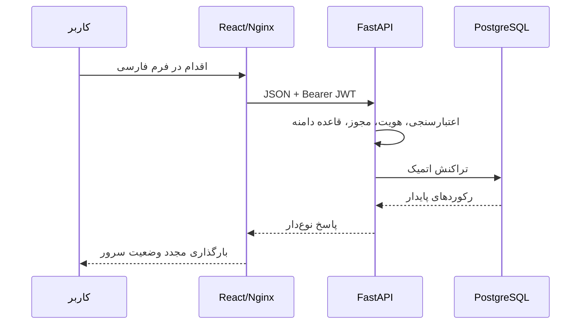

جلسه بانک برای هر درخواست ساخته می‌شود. سرویس‌ها مسئول commit/rollback هستند. برای عملیات چندمرحله‌ای مثل صدور فاکتور یا ثبت پرداخت، همه تغییرها یا با هم ثبت می‌شوند یا هیچ‌کدام باقی نمی‌مانند.

برای نمونه، صفحه فاکتور ابتدا مشتری و کالا را می‌گیرد، نبود مشتری فعال را با راهنمای فارسی نشان می‌دهد، ورودی پایه را کنترل و `POST /invoices` را ارسال می‌کند. backend به‌ترتیب JWT، `invoices:write`، schema، فعال‌بودن مشتری/کالا و تاریخ را بررسی، جمع‌ها را با Decimal محاسبه و invoice/items را commit می‌کند. پاسخ ذخیره‌شده باعث بسته‌شدن فرم و reload فهرست می‌شود.

چرخه‌های مهم دیگر نیز روشن‌اند: ورود به بررسی Argon2id و ساخت JWT می‌رسد؛ ثبت‌نام Viewer و audit می‌سازد؛ صدور فاکتور یک سند INV متوازن و ISSUED را اتمیک ایجاد می‌کند؛ دریافت ابتدا DRAFT و بعد از recheck تخصیص‌ها سند PAY و وضعیت مانده فاکتور را ثبت می‌کند؛ سند دستی هنگام post دوره/حساب/تعداد خطوط/توازن را می‌سنجد؛ reverse یک سند جدید با سمت‌های معکوس می‌سازد؛ گزارش فقط می‌خواند؛ و پیش‌بینی فقط `ml_predictions` می‌نویسد. retry عملیات کامل‌شده به‌جای ساخت رکورد تکراری با status/unique constraint رد می‌شود.

## ۴. ثبت‌نام، ورود، JWT و کنترل دسترسی

در ثبت‌نام، ایمیل trim و case-fold می‌شود، رمز باید بین ۱۲ تا ۱۲۸ نویسه باشد و با Argon2id هش می‌شود. حساب جدید فعال و فقط با نقش `VIEWER` ساخته می‌شود. رابط پس از ثبت‌نام، همان کاربر را وارد می‌کند و توکن را در `sessionStorage` با کلید `azari_token` نگه می‌دارد.

توکن شامل `sub`، نوع `access`، زمان صدور، انقضا و `jti` است. مدت پیش‌فرض ۳۰ دقیقه و بازه مجاز ۵ تا ۱۴۴۰ دقیقه است. هر درخواست حفاظت‌شده دوباره وجود و فعال‌بودن کاربر را بررسی می‌کند. هویت نامعتبر یا غیرفعال پاسخ ۴۰۱ می‌گیرد؛ کاربر معتبر بدون مجوز پاسخ ۴۰۳. نبود کاربر در ورود نیز یک بررسی هش ساختگی انجام می‌دهد تا تفاوت زمانی، وجود ایمیل را لو ندهد.

در نسخه فعلی refresh token، ابطال سمت سرور، فراموشی رمز، تأیید ایمیل، MFA و rate limit ورود وجود ندارد. چون توکن در فضای جاوااسکریپت مرورگر است، جلوگیری از XSS اهمیت زیادی دارد.

### ماتریس نقش‌ها

| قابلیت | ADMIN | ACCOUNTANT | MANAGER | VIEWER |
|---|---:|---:|---:|---:|
| مشاهده کاربران | بله | خیر | بله | خیر |
| طرف حساب، کالا و حساب | خواندن/نوشتن | خواندن/نوشتن | فقط خواندن | فقط خواندن |
| سند حسابداری | ایجاد و ثبت | ایجاد و ثبت | فقط خواندن | فقط خواندن |
| فاکتور | ایجاد و صدور | ایجاد و صدور | فقط خواندن | فقط خواندن |
| دریافت | ایجاد و ثبت | ایجاد و ثبت | فقط خواندن | فقط خواندن |
| دوره مالی | ایجاد و بستن | ایجاد و بستن | فقط خواندن | فقط خواندن |
| گزارش و داشبورد | بله | بله | بله | بله |
| مشاهده مدل | بله | بله | بله | بله |
| پیش‌بینی و بازخورد | بله | بله | بله | خیر |
| ثبت/فعال‌سازی مدل | بله | خیر | خیر | خیر |

`ADMIN` همه مجوزهای seedشده را دارد. چند مجوز مانند `users:create/update/delete` و `ml:train` تعریف شده‌اند ولی مسیر HTTP متناظر ندارند. مخفی‌کردن منو و دکمه برای تجربه کاربر است؛ مرز امنیتی واقعی dependency مجوز در backend است.

**نتیجه مهم برای کاربر:** کسی که از صفحه ثبت‌نام حساب می‌سازد Viewer است. او می‌تواند داده‌های مجاز را ببیند، اما دکمه ایجاد فاکتور ندارد و API نیز اجازه ایجاد نمی‌دهد. برای صدور فاکتور باید نقش ACCOUNTANT یا ADMIN از مسیر مدیریتی خارج از رابط خواندنی فعلی به او اختصاص یابد.

رویدادهای موفق و ناموفق ثبت‌نام/ورود و چند عملیات مدیریتی/حسابداری ممیزی می‌شوند. جزئیات ممیزی به‌صورت بازگشتی کلیدهای حساس مانند رمز و توکن را رد می‌کند. جدول ممیزی برای الحاق تاریخچه طراحی شده و API ویرایش/حذف ندارد.

## ۵. مدل داده؛ تمام جدول‌ها و ارتباط‌ها

شناسه همه موجودیت‌های کسب‌وکار UUID است. جدول‌های اصلی معمولاً `created_at` و `updated_at` منطقه‌زمانی دارند. حذف خطوط وابسته cascade است، اما حذف رکورد حسابداری مرجع معمولاً restrict می‌شود؛ حذف actor نیز شناسه او را null می‌کند تا سابقه از بین نرود.

| جدول | کاربرد | قیدهای اصلی |
|---|---|---|
| `users` | ایمیل، هش رمز، نام، وضعیت فعال، آخرین ورود | ایمیل یکتا؛ ارتباط چندبه‌چند با نقش |
| `roles` | نقش‌های چهارگانه | نام یکتا؛ ارتباط با کاربر و مجوز |
| `permissions` | رشته مجوز جزئی | نام یکتا |
| `user_roles` | واسط کاربر و نقش | کلید مرکب و cascade |
| `role_permissions` | واسط نقش و مجوز | کلید مرکب و cascade |
| `audit_events` | actor، عمل، منبع، موفقیت، جزئیات JSON و زمان | الحاقی؛ actor قابل null شدن؛ ایندکس زمانی/عمل |
| `parties` | مشتری/تأمین‌کننده و اطلاعات تماس | باید حداقل یکی از دو نقش را داشته باشد؛ فعال/غیرفعال |
| `products` | کد SKU، نام، واحد، قیمت | SKU یکتا و قیمت نامنفی |
| `account_categories` | گروه و نوع حساب | یکی از دارایی، بدهی، سرمایه، درآمد، هزینه |
| `accounts` | کد، نام، گروه، والد اختیاری | کد یکتا؛ جلوگیری از خودوالدی و چرخه در سرویس |
| `financial_periods` | بازه و وضعیت دوره | شروع ≤ پایان؛ OPEN/CLOSED؛ جلوگیری سرویس از هم‌پوشانی |
| `journal_entries` | شماره، تاریخ، دوره، وضعیت، سازنده و سند معکوس | شماره یکتا؛ DRAFT/POSTED/CANCELLED |
| `journal_lines` | حساب، شرح، بدهکار و بستانکار | دقیقاً یک سمت مثبت؛ مبلغ منفی ممنوع |
| `invoices` | شماره، مشتری، تاریخ‌ها، وضعیت، جمع‌ها، پرداخت‌شده و سند | تاریخ سررسید معتبر؛ جمع نامنفی؛ لینک سند یکتا |
| `invoice_items` | کالا/شرح، تعداد، قیمت، مالیات و جمع ردیف | تعداد مثبت؛ مبلغ‌ها نامنفی |
| `payments` | مرجع دریافت، مشتری، تاریخ، مبلغ، روش و سند | مبلغ مثبت؛ مرجع و لینک سند یکتا |
| `payment_allocations` | سهم دریافت تخصیص‌یافته به فاکتور | مبلغ مثبت؛ زوج پرداخت/فاکتور یکتا |
| `ml_model_versions` | pipeline، نسخه، artifact، schema، fingerprint، config، metrics و active | pipeline+version یکتا؛ یک نسخه فعال در PostgreSQL |
| `ml_predictions` | مدل، منبع، خروجی JSON، اطمینان، بررسی انسانی و توضیح | اطمینان صفر تا یک؛ ایندکس تاریخ/منبع |
| `ml_prediction_feedback` | نتیجه واقعی، نوع بازخورد، توضیح، ارسال‌کننده و زمان | VERIFIED/CORRECTION/COMMENT؛ الحاقی |
| `alembic_version` | شماره مهاجرت فعال | جدول داخلی Alembic |

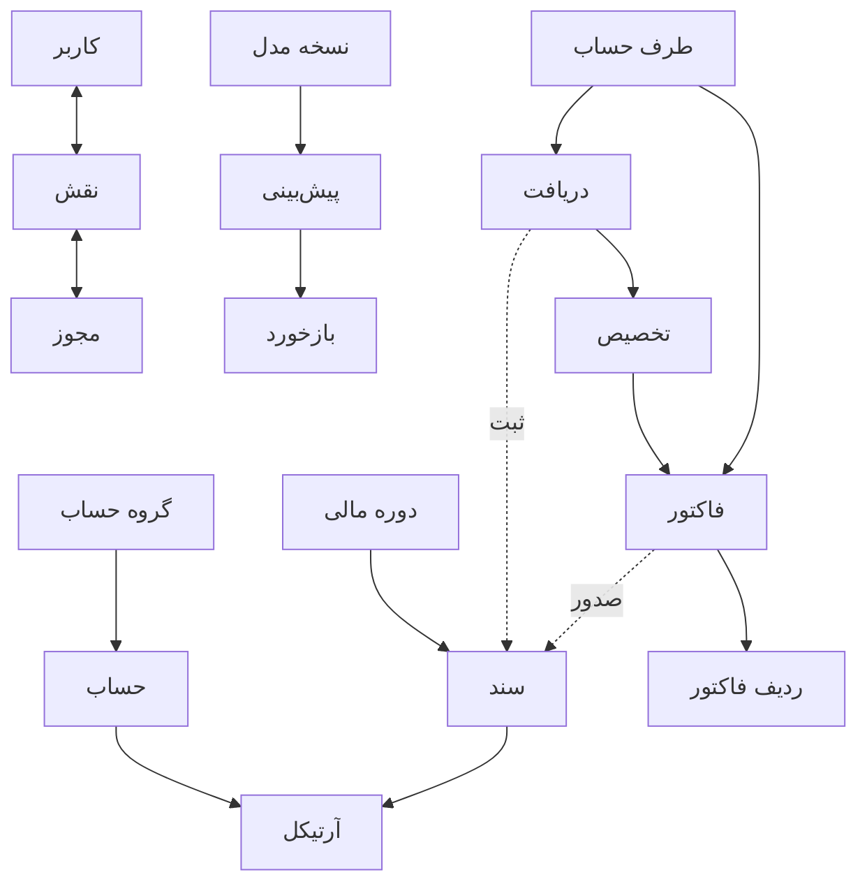

زنجیره مهاجرت از هویت (`20260817_0001`) به حسابداری (`cd6670d77e70`)، ایندکس‌های گزارش (`20260818_0002`) و ادغام ML (`20260825_0003`، head فعلی) می‌رسد. در شروع container، ابتدا `alembic upgrade head`، سپس seed نقش‌ها/ادمین اختیاری و بعد Uvicorn اجرا می‌شود.

## ۶. قواعد حسابداری و چرخه اسناد

همه مبلغ‌های معتبر با `Decimal` و روش ROUND_HALF_UP تا دو رقم اعشار محاسبه می‌شوند؛ تعداد کالا چهار رقم اعشار دارد. جمع‌های ارسالی مرورگر مرجع نیستند.

### مثال عددی و نگاشت آن به بانک

برای فاکتور ۱۱۰۰ واحدی، صدور یک ردیف در `journal_entries` و دو ردیف در `journal_lines` می‌سازد: حساب دریافتنی ۱۱۰۰ بدهکار و حساب درآمد ۱۱۰۰ بستانکار. `invoices.journal_entry_id` به آن سند POSTED وصل و وضعیت ISSUED می‌شود. دریافت ۵۰۰ واحدی نیز حساب نقد را ۵۰۰ بدهکار و دریافتنی را ۵۰۰ بستانکار می‌کند؛ `payment_allocations.amount=500` به همان فاکتور وصل، `amount_paid=500` و وضعیت PARTIALLY_PAID می‌شود. مانده ۶۰۰ است و دریافت بعدی ۶۰۰ آن را PAID می‌کند. هیچ جدول ML در این ثبت‌ها دخالت ندارد.

### قواعدی که سامانه هرگز نباید نقض کند

- جمع بدهکار و بستانکار هنگام ثبت برابر است؛ وگرنه دفتر کل و ترازنامه آشتی نمی‌کنند.
- هر آرتیکل دقیقاً یک سمت مثبت دارد؛ schema/service و قید بانک از خط مبهم یا دوطرفه جلوگیری می‌کنند.
- سند POSTED از API ویرایش/حذف نمی‌شود؛ اصلاح حسابداری از سند معکوس/جدید می‌آید تا تاریخچه حفظ شود.
- دوره باید OPEN و حساب‌ها active باشند؛ در غیر این صورت گزارش بسته‌شده یا حساب بازنشسته تغییر می‌کند.
- مبلغ فاکتور را backend محاسبه می‌کند؛ اعتماد به مرورگر امکان دست‌کاری مطالبات/درآمد می‌دهد.
- issue فقط یک‌بار از DRAFT و payment post فقط یک‌بار اجرا می‌شود؛ status و کلید یکتا مانع دوباره‌شماری‌اند.
- جمع allocation دقیقاً برابر payment، متعلق به همان مشتری و حداکثر مانده روز ثبت است؛ هنگام post دوباره کنترل می‌شود تا race condition باعث اضافه‌پرداخت نشود.
- دوره‌ها هم‌پوشان و hierarchy حساب چرخه‌ای نمی‌شوند.
- صدور/ثبت عملیات چندردیفی اتمیک است؛ شکست باید همه تغییرها را rollback کند.
- فقط یک مدل هر pipeline active است و feature تاریخی نباید از آینده نسبت به `as_of` استفاده کند.

این قواعد در یک لایه تکرار نشده‌اند: بعضی در Pydantic، بعضی در service و برخی نیز در constraint بانک هستند. این هم‌پوشانی برای حفاظت در برابر ورودی HTTP، concurrency و نوشتن خارج از API لازم است.

### اطلاعات پایه و دوره

- طرف حساب باید مشتری، تأمین‌کننده یا هر دو باقی بماند. ایجاد فاکتور/دریافت، مشتری فعال می‌خواهد.
- کالای فاکتور هنگام ساخت باید فعال باشد. حساب‌ها هنگام ثبت قطعی سند باید فعال باشند.
- تغییر والد حساب نباید چرخه بسازد.
- دوره‌ها نباید هم‌پوشانی داشته باشند. ثبت قطعی فقط در دوره OPEN انجام می‌شود.

### سند حسابداری

سند ابتدا DRAFT است. هر آرتیکل دقیقاً یک مبلغ بدهکار یا بستانکار مثبت دارد. ایجاد پیش‌نویس حتی با یک آرتیکل ممکن است و در این مرحله بازبودن دوره/فعال‌بودن حساب شرط نهایی نیست. هنگام `post` حداقل دو آرتیکل، دوره باز، حساب‌های فعال و برابری جمع بدهکار/بستانکار در دقت ریال/سنتی سیستم بررسی می‌شود. برگشت سند، سند POSTED تازه‌ای با جابه‌جایی دو سمت و شماره `REV-...` می‌سازد. برای هر سند فقط یک برگشت ممکن است و سند ساخته‌شده توسط فاکتور/دریافت از مسیر عمومی برگردانده نمی‌شود. API ویرایش یا حذف سند وجود ندارد.

### فاکتور فروش

ایجاد فاکتور، مشتری فعال، حداقل یک ردیف و جمع قطعی بیشتر از صفر می‌خواهد. برای کالای انتخابی، قیمت کاتالوگ مقدار پیش‌فرض است؛ ردیف آزاد باید قیمت داشته باشد. subtotal، مالیات، total و جمع ردیف را backend محاسبه می‌کند. فاکتور DRAFT هیچ اثر مالی بر دفتر کل، مطالبات، درآمد، جریان نقدی، گزارش‌ها یا جمع‌های داشبورد ندارد.

در صدور، سرویس دوره شامل تاریخ فاکتور را پیدا می‌کند و فقط حساب‌های فعال با نقش صریح `RECEIVABLE`، `REVENUE` و در صورت وجود مالیات `TAX_LIABILITY` را می‌پذیرد. سند `INV-{number}` کل مبلغ را به دریافتنی بدهکار، مبلغ جزء را به درآمد بستانکار و مالیات را به بدهی مالیات بستانکار می‌کند؛ سپس سند و فاکتور در همان تراکنش POSTED/ISSUED می‌شوند.

محدودیت فعلی: این تفکیک ثبت، موتور کامل مالیات حوزه قضایی نیست؛ نرخ‌گذاری، اظهارنامه و تسویه مالیات خارج از محدوده‌اند. ویرایش، ابطال، حذف و credit note فاکتور پیاده نشده است.

### دریافت مشتری

موجودیت `payment` فعلی در عمل دریافت از مشتری است. مجموع تخصیص‌ها باید دقیقاً برابر مبلغ مثبت دریافت باشد؛ فاکتور تکراری، مشتری متفاوت، وضعیت نامعتبر و تخصیص بیش از مانده رد می‌شود. هنگام ثبت، مانده‌ها دوباره داخل تراکنش بررسی می‌شوند، سند `PAY-{reference}` حساب نقد را بدهکار و دریافتنی را بستانکار می‌کند و `amount_paid` و وضعیت فاکتور به PARTIALLY_PAID یا PAID می‌رسد. وضعیت، قیود یکتا و rollback از ثبت تکراری جلوگیری می‌کنند.

پرداخت به تأمین‌کننده، دریافت بدون تخصیص و ابطال پرداخت وجود ندارد. ثبت دریافت فقط حساب‌های دارای نقش صریح `CASH` و `RECEIVABLE` را می‌پذیرد.

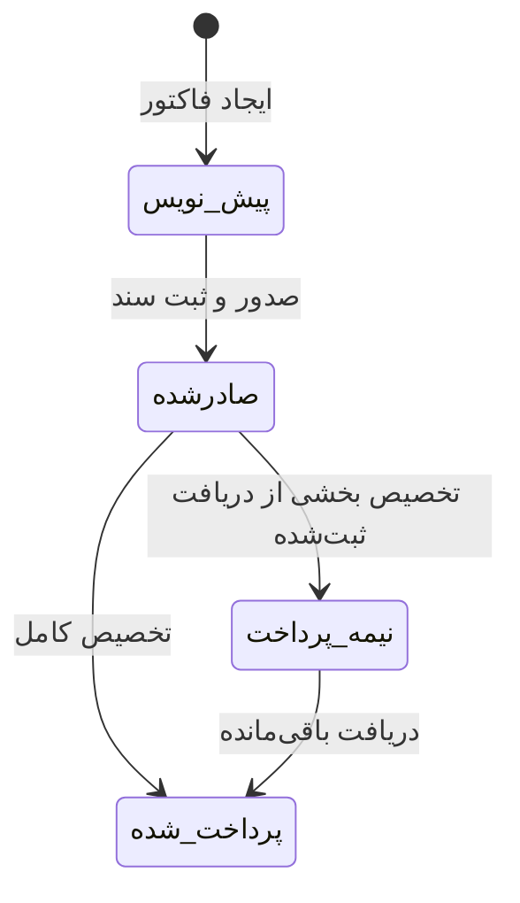

## ۷. گزارش‌ها و علت عددهای داشبورد

تراز آزمایشی، سودوزیان، درآمد، هزینه و ترازنامه فقط از آرتیکل‌های اسناد `POSTED` و بازه شامل ابتدا/انتها استفاده می‌کنند. ماهیت عادی دارایی/هزینه بدهکار و بدهی/سرمایه/درآمد بستانکار است. سود جاری از درآمد منهای هزینه محاسبه و در ترازنامه وارد می‌شود.

گزارش مطالبات، مبلغ فاکتور منهای تخصیص دریافت‌های POSTED تا تاریخ گزارش است. گزارش پرداختنی، صرفاً مانده حساب‌های نوع بدهی است و جزئیات فاکتور خرید ندارد. جریان نقدی فقط دریافت‌های ثبت‌شده مشتری را inflow می‌داند و outflow فعلاً صفر است. گردش طرف حساب، فاکتورها و دریافت‌های آن طرف را در بازه برمی‌گرداند.

داشبورد سه گروه داده را کنار هم می‌گذارد: درآمد/هزینه/سود از دفتر کل، خالص جریان نقد از دریافت‌های ثبت‌شده، و مانده/تعداد سررسیدگذشته از پرس‌وجوی مطالبات.

**نقص فعلی که مستقیماً در سورس تأیید شد:** شرط مطالبات فقط فاکتور `CANCELLED` را حذف می‌کند؛ در نتیجه `DRAFT` نیز شمرده می‌شود. بنابراین هر بار که پیش‌نویس فاکتور جدید می‌سازید، عدد مانده یا تعداد داشبورد ممکن است زیاد شود، حتی با اینکه سند حسابداری صادر نشده است. خود refresh داشبورد چیزی در بانک نمی‌نویسد. این رفتار با قاعده مورد انتظار «مطالبه پس از صدور» ناسازگار است و در این کار مستندسازی اصلاح نشده است.

گزارش‌ها pagination ندارند و باید معنای محدود پرداختنی و جریان نقدی در تفسیر مدیریتی رعایت شود.

## ۸. چهار جریان هوش مصنوعی

### قرارداد مشترک آموزش و استنتاج

آموزش کاملاً آفلاین و بر داده مصنوعی قطعی با seed انجام می‌شود. خروجی هر نسخه در `ml/models/<pipeline>/<version>` شامل `model.joblib` و `metadata.json` است. metadata نسخه schema، نام pipeline/model، زمان، fingerprint نوع SHA-256 از داده canonical، ویژگی‌ها، seed/config، معیارها، نسخه dependency و پرچم `synthetic=true` را نگه می‌دارد. API در شروع یا پیش‌بینی آموزش نمی‌دهد.

مدیر artifact را با شناسه محدود `pipeline/version` ثبت می‌کند. مسیر باید زیر `ML_MODEL_DIR` بماند؛ traversal، pipeline/schema/feature/version ناسازگار یا major version نامعتبر dependency رد می‌شود. PostgreSQL فقط یک مدل active برای هر pipeline می‌پذیرد. cache در حافظه همان process و با UUID مدل کلید می‌خورد؛ فعال‌سازی cache همان pipeline را خالی می‌کند، ولی چند worker cache مشترک ندارند.

### ۸.۱ طبقه‌بندی شرح تراکنش

۹۰۰ شرح فارسی مصنوعی به TF-IDF کلمه‌ای یک‌و‌دوواژه‌ای (`min_df=2`) تبدیل می‌شود. تقسیم ۷۵/۲۵ stratified و seeded است. MultinomialNB و LinearSVC کالیبره مقایسه و ابتدا با macro F1 و سپس accuracy انتخاب می‌شوند. آنلاین، دسته و احتمال برمی‌گردد؛ کمتر از `ML_CONFIDENCE_THRESHOLD` نیازمند بازبینی انسانی است. متن خام شرح در تاریخچه prediction ذخیره نمی‌شود. واژگان مصنوعی و calibration فعلی دلیل دقت تولیدی نیست.

### ۸.۲ ریسک تأخیر پرداخت

هدف، احتمال پرداخت بیش از هفت روز پس از سررسید است. ده ویژگی شامل مبلغ، تعداد/میانگین/تأخیر/نرخ دیرکرد و پرداخت قبلی، فراوانی فاکتور و دریافت، مانده و سابقه مشتری است. برای جلوگیری از leakage، هر ردیف فقط از تاریخچه‌ای استفاده می‌کند که پیش از همان فاکتور کامل شده؛ تقسیم ۷۰/۱۵/۱۵ زمانی است. RandomForest متوازن با ۱۸۰ درخت، عمق ۸ و حداقل leaf سه آموزش می‌بیند.

توضیح آنلاین حاصل `(مقدار - baseline آموزشی) × اهمیت کلی feature` و یک heuristic مرتب‌شده است؛ SHAP یا رابطه علّی نیست. رابط فقط فاکتور صادرشده/نیمه‌پرداخت را پیشنهاد می‌دهد، اما backend مستقیم فعلاً صرفاً آینده‌نبودن تاریخ فاکتور را کنترل می‌کند و می‌تواند برای draft نیز فراخوانی شود.

### ۸.۳ پیش‌بینی جریان نقد

مدل Prophet نیست؛ رگرسیون خطی روی trend و سینوس/کسینوس هفتگی، ماهانه و سالانه است. انتهای سری زمانی برای backtest کنار گذاشته و MAE/RMSE محاسبه می‌شود، سپس مدل با کل داده fit می‌شود. انحراف معیار residual یک بازه تقریبی ثابت ۹۵٪ می‌سازد. آنلاین فقط دریافت‌های POSTED را می‌خواند، با میانگین ۹۰ روز اخیر سطح baseline آفلاین را تنظیم و برای ۱ تا ۳۶۵ روز آینده پیش‌بینی می‌کند. خروجی نقد، آموزش آنلاین و بازه احتمالی کالیبره ندارد.

### ۸.۴ بخش‌بندی مشتری

هفت ویژگی تعداد/مجموع/میانگین فاکتور، مجموع دریافت، میانگین تأخیر، مانده و فراوانی پرداخت ساخته می‌شود. تقسیم ۸۰/۲۰ seeded است؛ scaler فقط روی train fit می‌شود. KMeans برای `k=2..6` با ۲۰ شروع اجرا و بیشترین silhouette انتخاب می‌شود؛ تساوی به k کوچک‌تر می‌رسد. شرح گروه از مقایسه centroidها و مفاهیمی مثل باارزش‌تر، کندپرداخت یا مانده بالا ساخته می‌شود و حکم سیاستی/علّی نیست. مشتری بدون تاریخچه قابل استفاده پاسخ ۴۲۲ می‌گیرد.

هر پیش‌بینی، مدل، خروجی ساخت‌یافته، confidence، نیاز به بازبینی، توضیح، کاربر و زمان را نگه می‌دارد. بازخورد VERIFIED/CORRECTION/COMMENT الحاقی است و خودکار مدل را آموزش نمی‌دهد. ثبت/فعال‌سازی مدل و بازخورد ممیزی می‌شوند. نبود مدل ۴۰۴، artifact ناسازگار ۴۲۲ و شکست اجرا ۵۰۳ است.

مرز نوشتن AI صریح است: inference فقط `ml_predictions`، feedback فقط `ml_prediction_feedback` و audit مربوط، و مدیریت مدل فقط `ml_model_versions`/audit را تغییر می‌دهد. این مسیرها service صدور فاکتور، ثبت دریافت یا journal post را صدا نمی‌زنند؛ پس balance، revenue و dashboard را تغییر نمی‌دهند. مجوزها به `ml:read/predict/feedback/manage` تقسیم شده و `ml:train` با وجود seedشدن route ندارد. خطای artifact مسیر واقعی filesystem را به پاسخ عمومی نمی‌دهد، secret در artifact نگه‌داری نمی‌شود و متن خام classification ذخیره نمی‌شود؛ بااین‌حال شناسه و aggregateهای تجاری prediction همچنان داده محافظت‌شده‌اند.

## ۹. رابط کاربری فارسی و تجربه فعلی

ریشه سند `lang=fa` و `dir=rtl` است. پوسته در دسکتاپ ناوبری گروه‌بندی‌شده بالای صفحه و در عرض کوچک drawer سمت راست، کارت موبایل و modal/bottom-sheet دارد. theme روشن/تاریک و نوع نمایش تاریخ در `localStorage` می‌ماند؛ تاریخ پیش‌فرض جلالی نمایش داده می‌شود ولی API همیشه تاریخ ISO میلادی می‌گیرد. نمودارها SVG/CSS کوچک خود پروژه‌اند.

زبان UI با قالب API و بانک یکی نیست: label فارسی و چیدمان RTL است، رقم مبلغ عمداً انگلیسی نمایش داده می‌شود، تقویم فقط نمایش/تبدیل ورودی را عوض می‌کند، نام field/enum در JSON انگلیسی و تاریخ ISO میلادی است و PostgreSQL متن Unicode را بدون ترجمه ذخیره می‌کند.

router ساده بر History API ساخته شده و کتابخانه React Router ندارد. مسیرهای عمومی `/login` و `/register` هستند. پس از ورود، داشبورد، طرف‌حساب، کالا، حساب، دوره، سند، فاکتور، دریافت، ۹ گزارش، داشبورد و چهار ابزار AI، مدیریت مدل، کاربران و تنظیمات نمایش وجود دارد. Nginx برای مراجعه مستقیم به هر route، `index.html` را برمی‌گرداند.

صفحه و دکمه براساس permission فیلتر می‌شوند. فرم‌هایی که داده پیش‌نیاز ندارند—مثل مشتری فعال برای فاکتور یا حساب برای آرتیکل—پیام راهنمای فارسی و مسیر مرتبط نشان می‌دهند و ارسال ناممکن را غیرفعال می‌کنند. داده هنگام mount و بعد از تغییر موفق reload می‌شود؛ Redux یا query cache وجود ندارد. خطاهای عمومی HTTP فارسی شده‌اند، ولی این تبدیل گاهی جزئیات دقیق validation سرور را پنهان می‌کند.

**واقعیت فونت:** CSS ترتیب `IRANSans, IRANSansX, Vazirmatn, Tahoma, sans-serif` را می‌خواهد؛ اما فایل مجاز IRANSans و `@font-face` در مخزن نیست. اگر سیستم کاربر فونت را نصب نداشته باشد، fallback دیده می‌شود. پس تضمین استفاده از IRANSans در نسخه فعلی درست نیست.

مدیریت کاربران فقط خواندنی و تنظیمات صرفاً نمایشی است. toast جامع، busy state برای همه دکمه‌ها و آزمون مرورگر end-to-end وجود ندارد.

## ۱۰. API فعلی به زبان کاربردی

تمام مسیرها زیر `/api/v1` هستند. health، readiness، register و login عمومی‌اند؛ بقیه JWT و مجوز می‌خواهند.

- هویت: `POST /auth/register`، `POST /auth/login`، `GET /auth/me` و `GET /users`.
- اطلاعات پایه: CRUD محدود party/product/account و ساخت/list category؛ ساخت/list/close دوره.
- سند: ساخت/list/detail و عملیات post/reverse.
- فاکتور: ساخت/list/detail و issue.
- دریافت: ساخت/list/detail و post.
- گزارش: trial balance، income statement، revenue، expenses، balance sheet، receivables، payables، cash flow و party history.
- داشبورد: `GET /dashboard`.
- ML: list/active/register/activate مدل؛ چهار endpoint پیش‌بینی؛ list/detail prediction و ثبت feedback.

برای جدول دقیق method/path/permission به بخش انگلیسی «API surface» مراجعه کنید؛ آن جدول از تمام decoratorهای route فعلی استخراج شده و خلاصه فارسی بالا همان سطح را پوشش می‌دهد.

## ۱۱. Docker، پورت‌ها و پیکربندی

| سرویس | پورت میزبان | پورت داخل container | نشانی کاربردی |
|---|---:|---:|---|
| frontend | 4173 | 80 | `http://localhost:4173` |
| backend | 8100 | 8000 | `http://localhost:8100/api/v1` |
| PostgreSQL | منتشر نشده | 5432 | فقط `db:5432` در شبکه Compose |

علت تغییر پورت، رزرو Windows برای محدوده شامل ۵۱۷۳/۵۱۷۴ و محدوده ۷۹۲۷ تا ۸۰۲۶ شامل ۸۰۰۰ بود. پورت داخلی FastAPI همچنان ۸۰۰۰ و Nginx همچنان ۸۰ است. آدرس مرورگر با localhost میزبان فرق دارد؛ backend برای بانک باید نام سرویس `db` را به کار ببرد.

Compose ابتدا PostgreSQL را با `pg_isready` سالم می‌کند، بعد backend مهاجرت Alembic و bootstrap را اجرا کرده و Uvicorn را بالا می‌آورد؛ frontend منتظر readiness وابسته به بانک است و healthcheck HTTP مستقل دارد. image backend وابستگی ML را نصب، model directory کنترل‌شده را به‌صورت read-only mount و با کاربر غیر root اجرا می‌کند. image frontend در Node 22 build و در Nginx سرو می‌شود. `.dockerignore`ها cache پایتون، venv، `.env`، Git، node_modules، dist و artifact تولیدی مدل را حذف می‌کنند، نه سورس و lockfile لازم را.

Image قالب تغییرناپذیر build و container نمونه درحال اجراست. Compose هر سه container را در network خصوصی می‌گذارد تا نام DNS مانند `db` معتبر باشد. volume نام‌دار `postgres_data` پس از بازسازی container بانک باقی می‌ماند و bind mount مدل، artifact کنترل‌شده میزبان را در `/app/ml/models` قابل خواندن می‌کند. healthcheck فقط نمایشی نیست و ترتیب شروع dependencyها را کنترل می‌کند.

متغیرهای حیاتی عبارت‌اند از `DATABASE_URL`، `JWT_SECRET` حداقل ۳۲ نویسه، `JWT_ALGORITHM`، انقضای توکن، `CORS_ORIGINS`، `ML_MODEL_DIR`، آستانه confidence، seed/delay/horizon آموزش، زوج اختیاری bootstrap admin، متغیرهای PostgreSQL و `VITE_API_URL`. فایل `.env` محرمانه و ignoreشده است؛ فقط `.env.example` باید الگو باشد.

`DATABASE_URL` و password بانک و `JWT_SECRET` محرمانه‌اند؛ `BOOTSTRAP_ADMIN_PASSWORD` نیز هرگز نباید commit/log شود. `API_V1_PREFIX` مسیر API، `CORS_ORIGINS` مبدأ مرورگر، `ML_MODEL_DIR` ریشه امن artifact و `ML_CONFIDENCE_THRESHOLD` مرز review را تعیین می‌کنند. `ML_RANDOM_SEED/RISK_DELAY_DAYS/FORECAST_HORIZON` فقط تنظیم آموزش آفلاین‌اند. `VITE_API_URL` هنگام build داخل asset مرورگر قرار می‌گیرد و بنابراین secret نیست. `POSTGRES_DB/USER/PASSWORD` container بانک را می‌سازند و زوج email/password ادمین باید با هم یا هیچ‌کدام تنظیم شود.

## ۱۲. آزمون و روش توسعه امن

در backend باید مجموعه pytest با coverage، Ruff و mypy strict اجرا شود. آزمون‌های عادی از SQLite حافظه‌ای و seed RBAC استفاده می‌کنند؛ بررسی‌های جداگانه PostgreSQL برای ویژگی‌های خاص آن لازم است. تغییر schema باید Alembic migration داشته باشد و با `upgrade head` و `alembic check` کنترل شود؛ `create_all` جای مهاجرت تولیدی نیست.

در frontend، `test.cmd`، `npm run typecheck` و `npm run build` سه دروازه‌اند. آزمون‌ها بیشتر منطق component/module را از مسیر SSR/Vite و Node test runner بررسی می‌کنند و جای آزمون کامل browser را نمی‌گیرند. برای اجرا نیز `docker compose config`، build/up، health بانک/backend، `docker compose ps` و پاسخ HTTP هر دو پورت باید کنترل شود.

هر لایه خطر متفاوتی را می‌گیرد: unit/service قاعده و rollback، API قرارداد و 401/403، database قید/رابطه و تفاوت PostgreSQL، ML نشت زمانی و reproducibility، frontend RTL/route/permission/format، Alembic drift، Ruff خطای رایج، mypy/TypeScript ناسازگاری type، build قابلیت بسته‌بندی و Compose سلامت واقعی شبکه را. اجرای mypy از root باید `--config-file backend/pyproject.toml` داشته باشد؛ وگرنه overrideهای dependency و plugin Pydantic اعمال نمی‌شوند.

## ۱۳. تاریخچه مرحله‌ها

۱) زیرساخت Docker، health، ignore و پورت‌های قابل اجرا. ۲) هویت، PostgreSQL، Alembic، RBAC و ممیزی. ۳) دامنه حسابداری و اسناد/فاکتور/دریافت. ۴) گزارش و داشبورد. ۵) چهار pipeline آفلاین ML. ۶) registry، فعال‌سازی، استنتاج و feedback. ۷) frontend تولیدی فارسی. ۸) سخت‌سازی responsive/accessibility/error/test/runtime. پس از مرحله ۸، ثبت‌نام عمومی backend/frontend با نقش Viewer اضافه شد.

گزارش‌های هر مرحله باید به‌عنوان عکس تاریخی خوانده شوند. پورت قدیمی، تعداد آزمون قدیمی یا جمله «مرحله بعد شروع نشده» را نباید بر تنظیم امروز مقدم دانست.

## ۱۴. محدودیت‌ها و ناسازگاری‌های مهم

1. کاربر ثبت‌نامی Viewer است و بدون تخصیص نقش نمی‌تواند فاکتور بسازد.
2. IRANSans در سورس نام‌گذاری شده ولی asset آن بسته‌بندی نشده است.
3. draft فاکتور از مطالبات و dashboard حذف می‌شود؛ تاریخچه «as-of» هنوز بر `issue_date` تکیه دارد و `issued_at` جدا ندارد.
4. خرید/پرداخت تأمین‌کننده و subledger پرداختنی وجود ندارد.
5. جریان نقد فقط دریافت ورودی است.
6. مالیات فاکتور به حساب دارای نقش `TAX_LIABILITY` می‌رود، اما محاسبه، اظهارنامه و تسویه مالیاتی حوزه قضایی پیاده نشده است.
7. نوع کلی ASSET/REVENUE و تطابق حساب دریافتنی enforce می‌شود، اما نقش جزئی‌تر control account در مدل وجود ندارد.
8. ویرایش/حذف/ابطال و credit note عملیات اصلی موجود نیست.
9. چندشرکتی، ارز، انبار و مغایرت بانکی وجود ندارد.
10. list/reportها pagination ندارند.
11. چرخه کامل امنیت حساب و token refresh/revocation وجود ندارد.
12. mutation مدیریت کاربر/نقش در API و UI نیست.
13. داده ML مصنوعی است و معیارها اعتبار تجاری را اثبات نمی‌کنند.
14. cache مدل میان processها مشترک نیست.
15. feedback آموزش خودکار ایجاد نمی‌کند.
16. endpoint مستقیم ریسک وضعیت فاکتور را به سخت‌گیری UI محدود نمی‌کند.
17. مشتری بی‌تاریخچه segment نمی‌شود.
18. forecast خرج و عامل بیرونی ندارد.
19. پیام عمومی frontend گاهی جزئیات خطای backend را پنهان می‌کند.
20. آزمون end-to-end مرورگر وجود ندارد.

## ۱۵. راهنمای رفع اشکال سریع

1. خطای bind روی ۵۱۷۳/۵۱۷۴: config باید frontend را روی host 4173 نشان دهد.
2. خطای bind روی ۸۰۰۰: host فعلی 8100 است؛ container 8000 بماند.
3. CORS/network: مقدار build-time `VITE_API_URL` و `CORS_ORIGINS` را بررسی کنید.
4. اتصال بانک: در container از `db` استفاده کنید، نه localhost.
5. خروج backend پیش از Uvicorn: log مهاجرت/bootstrap و secret/URL/زوج admin را ببینید.
6. 401 پس از ورود: انقضا، secret/algorithm و فعال‌بودن کاربر؛ token sessionStorage را پاک کنید.
7. 403: role و permission در `/auth/me`/seed؛ UI مرجع امنیت نیست.
8. نبود دکمه فاکتور: نقش Viewer مجوز `invoices:write` ندارد.
9. select مشتری خالی: طرف حساب فعال با `is_customer=true` بسازید.
10. خطای صدور: دوره شامل تاریخ باید باز و حساب‌ها فعال باشند.
11. خطای ثبت سند: دو خط یا بیشتر، توازن، حساب فعال و دوره باز لازم است.
12. خطای ثبت دریافت: جمع تخصیص، مشتری، وضعیت و مانده فاکتور را کنترل کنید.
13. رشد dashboard با draft: نقص شناخته‌شده query مطالبات است.
14. گزارش خالی: سند باید POSTED و تاریخ در بازه باشد.
15. پرداختنی بدون تأمین‌کننده: گزارش فعلی exposure حساب بدهی است.
16. outflow صفر: پرداخت خروجی پیاده نشده است.
17. مدل فعال نیست: آفلاین آموزش، سپس register و activate با Admin.
18. artifact ناسازگار: مسیر، metadata/schema/features/checksum/dependency را کنترل کنید.
19. review دائم classification: confidence زیر threshold است.
20. segmentation 422: تاریخچه معتبر فاکتور و دریافت لازم است.
21. فونت اشتباه: IRANSans bundle نشده و fallback فعال است.
22. خطای build context روی cache: `.dockerignore` را اصلاح/بررسی کنید؛ حذف دستی cache راه‌حل پیکربندی نیست.

## ۱۶. بیست اصل برای توسعه‌دهنده بعدی

1. سورس زنده و migration بر متن تاریخی مقدم است.
2. مبلغ و وضعیت حسابداری در backend تعیین می‌شود.
3. گزارش مالی از سند POSTED می‌آید.
4. draft هنوز ledger نیست.
5. ثبت قطعی به دوره باز نیاز دارد.
6. توازن در دقت دو اعشار سنجیده می‌شود.
7. issue و payment post اتمیک‌اند.
8. تاریخچه ممیزی/ثبت‌شده را برای اصلاح ظاهری حذف نکنید.
9. secret، `.env` و artifact تولیدی را commit نکنید.
10. localhost میزبان با نام سرویس داخل Docker فرق دارد.
11. پورت‌های 4173/8100 به دلیل رزرو واقعی Windows انتخاب شده‌اند.
12. ثبت‌نام فقط Viewer می‌سازد.
13. کنترل backend حتی با دکمه مخفی الزامی است.
14. شناسه‌ها UUID و معنای date/time باید حفظ شود.
15. آموزش ML آفلاین است.
16. artifact مسیر دلخواه نیست و باید version/schema معتبر داشته باشد.
17. معیار داده مصنوعی ادعای دقت تجاری نیست.
18. هر تغییر schema مهاجرت Alembic می‌خواهد.
19. پیش از تحویل، همه آزمون‌ها/lint/type/build/migration مرتبط را اجرا کنید.
20. نقص فعلی را شفاف ثبت کنید، اما آن را قاعده مطلوب معرفی نکنید.

## ۱۷. خلاصه جریان داده برای نگهداری

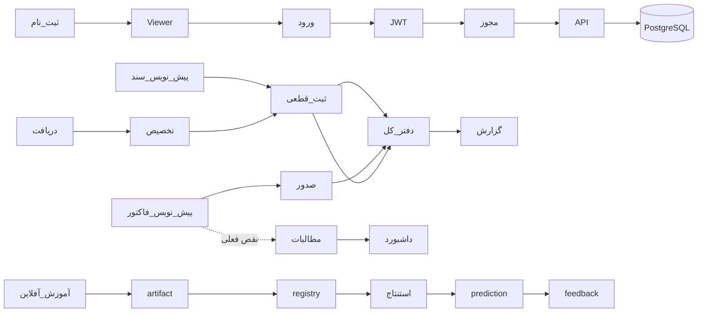

واژه‌نامه دوزبانه کامل در پایان بخش انگلیسی آمده و معادل‌های این بخش را یکسان می‌کند.

---

## Validation report / گزارش اعتبارسنجی سند

This handbook was cross-checked against the current repository rather than copied from stage reports:

| Validation item | Result | Evidence |
|---|---|---|
| API coverage | **PASS** | All 57 decorators across health/readiness, auth, users, accounting, reporting and ML are represented by the API table/action flows |
| Database coverage | **PASS** | All 20 application tables plus Alembic bookkeeping, relationships, constraints and lifetime rules are described |
| Accounting workflow coverage | **PASS** | Master data, numeric double-entry mapping, invariants, journals, invoices, receipts, reports and dashboard are covered |
| ML coverage | **PASS** | All four pipelines, offline/online split, features/algorithms/evaluation/artifacts/registry/inference/security/limits are covered |
| Frontend coverage | **PASS** | Public/protected route families, session/RBAC, pages, state, RTL/theme/calendar/responsive/chart/font behavior are covered |
| Security/RBAC coverage | **PASS** | Actual bootstrap roles/permissions, 401/403, JWT/Argon2id, audit and ML permissions are covered |
| Docker coverage | **PASS** | Three services, health ordering, volume/network concepts, environment, ignores and rendered 4173/8100 mappings are covered |
| Debugging coverage | **PASS** | The 22 requested failure classes include causes, inspection points, commands, expected behavior and unsafe actions |
| English/Persian completeness | **PASS** | Both sections explain architecture, domain, ML, UI, runtime, testing, history, limitations and debugging in natural language |

Configuration comparison includes backend settings, offline ML settings, Compose/PostgreSQL values, and the frontend build-time URL without exposing `.env` secrets. RBAC was compared to `bootstrap.py`; accounting invariants were compared to services, constraints and tests; route/table/page names and Docker ports were checked mechanically.

**Remaining documentation gaps:** there is no generated column-by-column data dictionary or checked-in OpenAPI snapshot, and Mermaid rendering depends on the Markdown viewer. The table descriptions and API inventory cover the current system, but a future schema/route change still requires a same-commit handbook update. Historical stage files intentionally retain old test counts, old boundary statements and recorded failures rather than being rewritten.

**Current documented limitations:** new registrations are Viewer-only, IRANSans is not bundled, historical receivables have no separate issuance timestamp, and historical stage documents contain old ports/test counts/stage-boundary statements. Stage 9 fixed draft reporting, semantic financial account roles, concurrent receipt allocation, historical category/role mutation, zero invoices, tax-liability posting, closed-period reversal rollback, model-artifact integrity, readiness, and related UI/API validation.

Verification run on 2026-08-27 against the documented tree:

- Backend/API and offline ML tests: **76 passed**, 95% combined coverage.
- Ruff: **PASS**.
- Strict mypy: **PASS**, 91 source files, using `backend/pyproject.toml`.
- Frontend: **19 tests passed**; standalone TypeScript check and production build **PASS**.
- Compose render: **PASS**; rendered mappings are backend `8100 -> 8000` and frontend `4173 -> 80`.
- Non-failing warnings: upstream Starlette/httpx and joblib/NumPy deprecations remain; the known Windows ACL still prevents pytest from writing `backend/.pytest_cache`.

### Maintenance rule

When implementation changes, update this handbook in the same commit. Verify route and table inventories mechanically, explain newly introduced invariants in both languages, and keep historical failure/stage records accurate instead of rewriting history.
